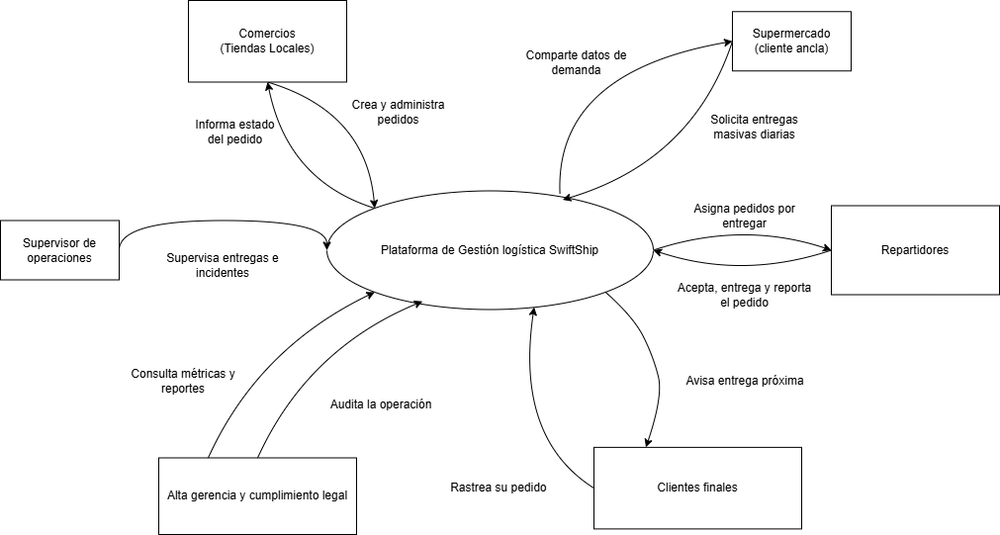
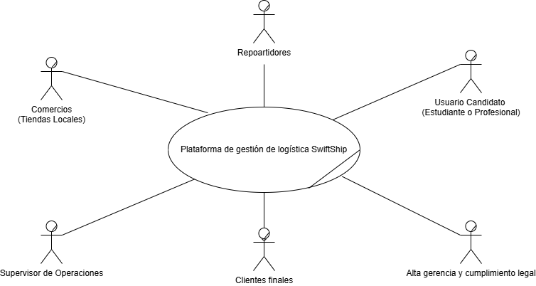
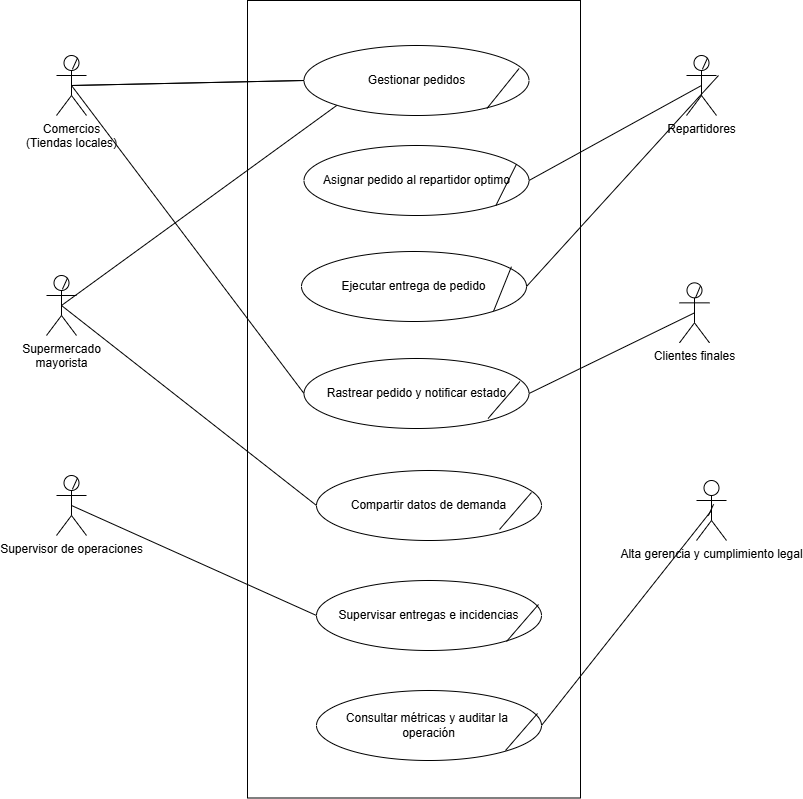
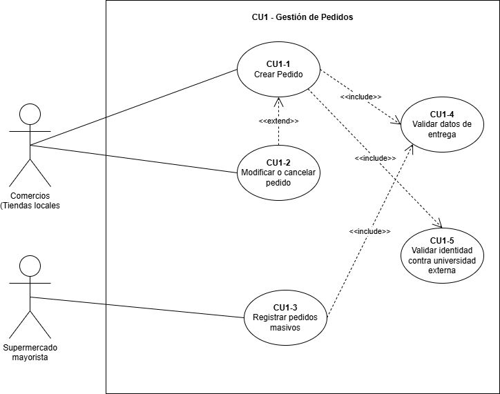
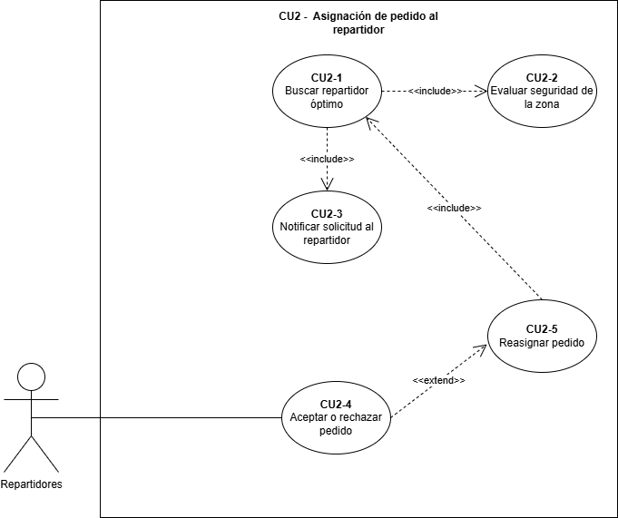
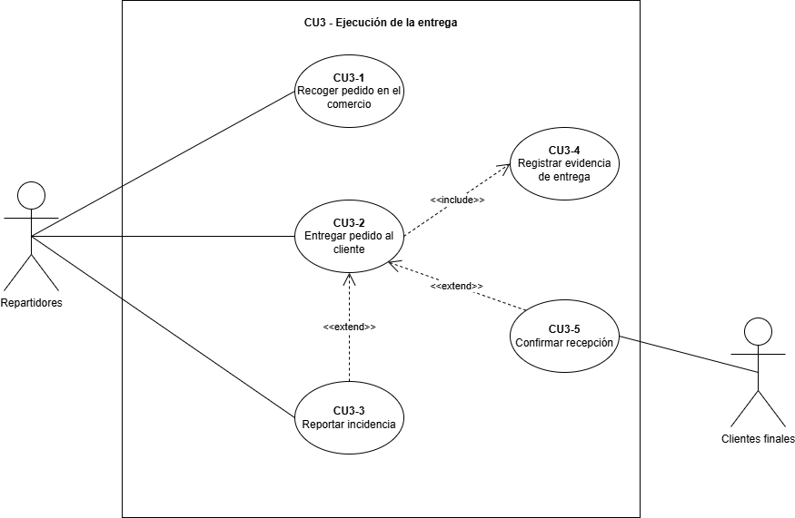
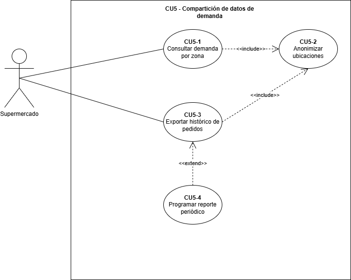
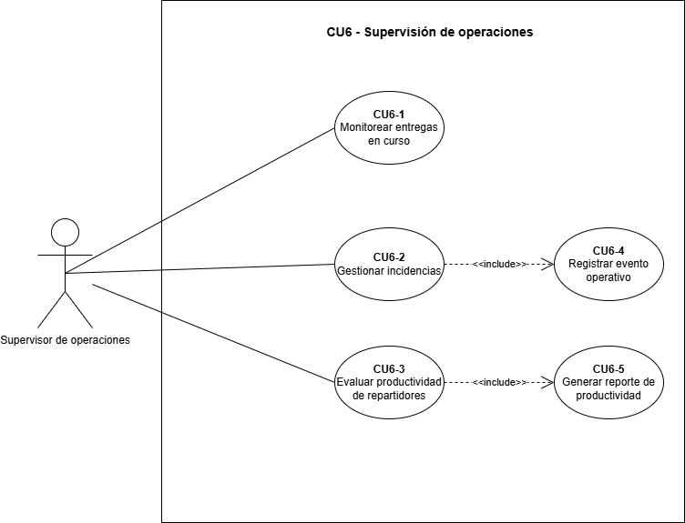
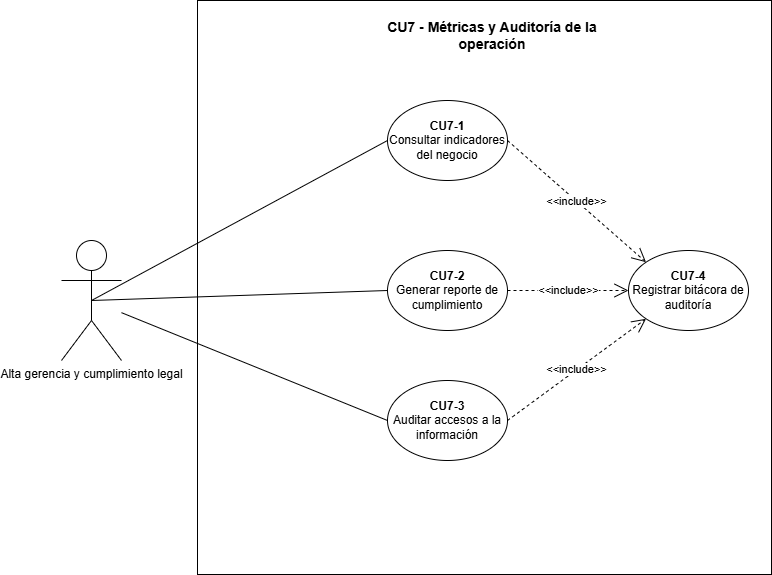

# Tarea 1 - Caso SwiftShip

| Campo | Información |
|---|---|
| Nombre | Luis Fernando Sánchez Santos |
| Carnet externo | 3348212820901 |
| Registro académico | 201930697 |
| Curso | Análisis y Diseño de Sistemas 2 |
| Sección | P |

## Menú de navegación

- [Caso del Negocio](#caso-del-negocio)
  - [Diagrama de contexto](#diagrama-de-contexto)
  - [Core del negocio - Caso de uso de alto nivel](#core-del-negocio---caso-de-uso-de-alto-nivel)
  - [Listado de Stakeholders](#listado-de-stakeholders)
    - [Stakeholders Directivos](#1-stakeholders-directivos)
    - [Stakeholders Financieros](#2-stakeholders-financieros)
    - [Stakeholders Operativos](#3-stakeholders-operativos)
    - [Stakeholders Externos](#4-stakeholders-externos)
  - [Primera descomposición](#primera-descomposición)
  - [Casos de uso expandidos](#casos-de-uso-expandidos)
  - [Descripciones textuales de los casos de uso expandidos](#descripciones-textuales-de-los-casos-de-uso-expandidos)

- [Drivers Arquitectónicos](#drivers-arquitectonicos)
  - [Drivers Funcionales RF](#drivers-funcionales-rf--plataforma-de-gestión-logística-swiftship)
  - [Drivers de Atributos de Calidad](#drivers-de-atributos-de-calidad)
  - [Drivers de Restricción](#drivers-de-restricción)
  - [Priorización de los 5 Drivers más Críticos](#priorización-de-los-5-drivers-más-críticos-según-el-contexto-guatemalteco)

- [Matrices de Trazabilidad de Requerimientos](#matrices-de-trazabilidad-de-requerimientos)
  - [Matriz Stakeholders vs. Casos de Uso](#1-matriz-stakeholders-vs-casos-de-uso)
  - [Matriz Casos de Uso vs. Drivers RF](#2-matriz-casos-de-uso-vs-drivers-rf)
  - [Matriz Stakeholders vs. Drivers RF](#3-matriz-stakeholders-vs-drivers-rf)

## Caso del Negocio

### Diagrama de contexto

### Core del negocio - Caso de uso de alto nivel 

<b>Descripción del Core:</b>
 
Plataforma que gestiona entregas urbanas en tiempo real, conectando los pedidos de comercios y del supermercado mayorista con repartidores independientes mediante la asignación automática del repartidor óptimo, con rastreo del pedido durante todo su ciclo de vida, recolección de evidencia de entrega, supervisión de incidencias y consulta de métricas y auditoría de la operación, todo esto a nivel urbano y multiciudad.

### Listado de Stakeholders
## 1. Stakeholders Directivos
 
### 1.1 Gerencia General de SwiftShip
- **Rol:** Patrocinador principal del proyecto y responsable del contrato con el supermercado mayorista.
- **Intereses:** Sostener el crecimiento del 300% del último año con una plataforma escalable, confiable y en tiempo real, y cumplir el contrato de 5,000 pedidos diarios con entrega en menos de 45 minutos para evitar multas millonarias.
- **Preocupaciones arquitectónicas:**
  - La plataforma debe eliminar las pérdidas diarias por caídas en horas pico, los retrasos en asignación y la falta de trazabilidad del sistema actual.
  - El MVP debe estar listo en 4 meses, con el motor de asignación básico funcionando.
  - La disponibilidad debe alcanzar 99.99% en el horario de operación (6am a 11pm).
- **Conflictos potenciales:** La urgencia del contrato firmado (multas por incumplimiento) presiona el plazo de 4 meses y puede entrar en tensión con la calidad de la arquitectura y la capacidad real del equipo de 8 personas.
---
 
### 1.2 Inversionistas (Fondo de Venture Capital)
- **Rol:** Financiadores del crecimiento; exigen expansión y preparan la venta de la empresa.
- **Intereses:** Escalar a 5 ciudades más en 12 meses y, en el fondo, vender SwiftShip en 2-3 años con una arquitectura atractiva para compradores: moderna, de bajo costo operativo y separable en unidades de negocio.
- **Preocupaciones arquitectónicas:**
  - Diseñar límites de dominio claros (DDD) que permitan un posible spin-off, por ejemplo vender el motor de asignación como producto independiente.
  - Mantener APIs públicas bien documentadas como activo de negocio.
  - Desacoplar facturación, asignación, rastreo y analítica en servicios independientes, evitando una dependencia excesiva de un solo proveedor (vendor lock-in).
- **Conflictos potenciales:** La exigencia de crecer a 5 ciudades en 12 meses compite con el presupuesto operativo limitado y con el plazo corto del MVP; además, evitar el vendor lock-in choca con la restricción corporativa de operar en AWS.
---
 
## 2. Stakeholders Financieros
 
### 2.1 Dirección Financiera de SwiftShip
- **Rol:** Controlador del presupuesto operativo de la nueva plataforma.
- **Intereses:** Que la operación completa en la nube (cómputo, almacenamiento, transferencia y servicios gestionados) no supere los $15,000 USD mensuales.
- **Preocupaciones arquitectónicas:**
  - El costo cloud debe ser predecible, sin sorpresas que obliguen a recortes de personal.
  - Si se excede el presupuesto, deben degradarse primero las funciones no críticas antes de poner en riesgo la operación (modo de degradación controlada).
- **Conflictos potenciales:** El techo de $15,000 mensuales entra en tensión directa con la disponibilidad de 99.99%, los picos de 20,000 pedidos por hora los viernes y el rastreo continuo de 2,000 repartidores simultáneos.
---
 
## 3. Stakeholders Operativos
 
### 3.1 Gerente de Operaciones (Don Carlos)
- **Rol:** Responsable de la operación diaria de entregas; 30 años de experiencia en logística.
- **Intereses:** Lo que dice: un dashboard para ver dónde están los repartidores y cuántos pedidos van tarde. Lo que realmente quiere: reportes de productividad individual con evidencia inobjetable que le permitan tomar decisiones laborales sin riesgo de demandas, y métricas impecables para justificar su bono anual ante la gerencia general.
- **Preocupaciones arquitectónicas:**
  - Cada evento del repartidor (pausas, desvíos, entregas completadas) debe quedar auditado con fecha, hora y geolocalización.
  - Los reportes de eficiencia por repartidor deben ser legalmente defendibles.
- **Conflictos potenciales:** Su interés en vigilar y evaluar individualmente a los repartidores entra en tensión con la protección de la privacidad y las condiciones laborales que defiende la Jefa de Repartidores.
---
 
### 3.2 Director de TI (Mario)
- **Rol:** Responsable de la infraestructura tecnológica y de la disponibilidad del servicio.
- **Intereses:** Lo que dice: pasar a la nube para no administrar servidores y mejorar la disponibilidad. Lo que realmente quiere: que cuando algo falle, la responsabilidad quede claramente delimitada fuera de su gestión, y que el presupuesto cloud sea predecible para que no le recorten personal.
- **Preocupaciones arquitectónicas:**
  - Diseñar con dominios de fallo claros, donde cada falla se aísle a una zona y no tumbe toda la operación.
  - Contar con un tablero de cumplimiento por componente (asignación 99.99%, notificaciones 99.9%) que delimite responsabilidades.
  - Disponer de un modo de degradación controlada que sacrifique funciones no críticas antes de una caída total.
- **Conflictos potenciales:** Su necesidad de delimitar responsabilidades ("no fue mi culpa") puede sesgar decisiones de arquitectura hacia la protección personal más que hacia el beneficio global del negocio.
---
 
### 3.3 Jefa de Repartidores (Lucía)
- **Rol:** Representante y defensora de la base de repartidores; ex repartidora.
- **Intereses:** Lo que dice: que la app funcione con datos móviles malos y no consuma tanta batería. Lo que realmente quiere: que los repartidores sientan que la plataforma los protege — del cliente que miente sobre "no recibido", de las zonas peligrosas, de castigos por rechazar pedidos de alto riesgo y de "ajustes manuales" que les roben comisiones — para frenar la rotación del 23% mensual.
- **Preocupaciones arquitectónicas:**
  - Registro de evidencia fotográfica al completar cada entrega.
  - Asignación que considere la seguridad de la zona (evitar ciertas colonias después de las 8pm) sin penalizar el rechazo.
  - Cálculo de comisiones transparente y visible antes de aceptar cada pedido.
  - Operación con conectividad inestable: las entregas deben poder registrarse sin cobertura y consolidarse después (offline-first), en celulares de gama media-baja.
- **Conflictos potenciales:** La protección de la ubicación y los derechos de los repartidores (pausar geolocalización fuera de horario, no ser castigados) entra en tensión con la vigilancia detallada que exige el Gerente de Operaciones para sus reportes de productividad.
---
 
### 3.4 Equipo de Desarrollo (8 personas)
- **Rol:** Responsables de construir la plataforma: 5 backend, 1 frontend web, 1 móvil y 1 DevOps.
- **Intereses:** Entregar el MVP en 4 meses con un alcance técnicamente realizable para el tamaño del equipo.
- **Preocupaciones arquitectónicas:**
  - La arquitectura debe ser construible y operable por un equipo pequeño, priorizando servicios gestionados sobre componentes a medida.
  - El motor de asignación no puede apoyarse en bases de datos relacionales para su operación en caliente (restricción interna por latencia).
- **Conflictos potenciales:** La ambición del alcance (tiempo real, alta disponibilidad, múltiples aplicaciones) frente a un equipo de 8 personas y 4 meses puede forzar recortes de alcance o deuda técnica.
---
 
## 4. Stakeholders Externos
 
### 4.1 Supermercado Mayorista (Cliente Ancla)
- **Rol:** Cliente principal con contrato millonario: 5,000 pedidos diarios con promesa de entrega en menos de 45 minutos.
- **Intereses:** Lo que dice: que cada pedido se entregue en menos de 45 minutos o aplicarán penalizaciones. Lo que realmente quiere: usar los datos de demanda en tiempo real para optimizar su propio inventario y ahorrar 15% en cadena de frío, y ofrecer a sus clientes una aplicación con su propia marca (marca blanca).
- **Preocupaciones arquitectónicas:**
  - Acceso a los eventos de demanda con las ubicaciones exactas anonimizadas.
  - Una plataforma preparada desde el inicio para servir a múltiples marcas (multi-tenant / whitelabel).
  - Que la analítica no afecte la operación de entregas en curso (separación entre operación y análisis).
- **Conflictos potenciales:** Su apetito por datos detallados de demanda choca con la anonimización que exige el equipo legal; su queja vigente (solo 68% de pedidos cumplen los 45 minutos) lo convierte en el stakeholder con mayor poder de presión.
---
 
### 4.2 Comercios Locales
- **Rol:** Clientes que generan los pedidos del día a día conectándose con repartidores a través de la plataforma.
- **Intereses:** Crear y administrar sus pedidos de forma confiable, sin perder ventas por caídas (1,234 pedidos perdidos en el último mes) y conociendo el estado de cada entrega.
- **Preocupaciones arquitectónicas:**
  - Sus pedidos no deben perderse aunque alguna parte de la operación falle.
  - Ningún comercio debe poder ver los pedidos de otro comercio (aislamiento total por comercio), pues constituiría competencia desleal.
- **Conflictos potenciales:** Ninguno crítico; su interés en la confiabilidad está alineado con los objetivos centrales de la plataforma.
---
 
### 4.3 Repartidores Independientes
- **Rol:** Fuerza de entrega de la operación; usuarios de la aplicación móvil en celulares de gama media-baja con conexión 4G inestable.
- **Intereses:** Trabajar con una aplicación que no consuma su batería ni sus datos, recibir asignaciones justas, comisiones transparentes y protección ante reclamos falsos y zonas inseguras.
- **Preocupaciones arquitectónicas:**
  - La aplicación debe funcionar en equipos Android 10 o superior con 3GB de RAM o menos y conectividad intermitente.
  - Poder pausar la geolocalización fuera del horario laboral (separación entre vida laboral y personal).
  - La filtración de la ubicación de un repartidor representa un riesgo penal para la empresa y un riesgo físico para la persona.
- **Conflictos potenciales:** La rotación del 23% mensual demuestra su poder real: si la plataforma los castiga o vigila en exceso, se van a la competencia y el negocio pierde su capacidad de entrega.
---
 
### 4.4 Clientes Finales
- **Rol:** Destinatarios de las entregas; rastrean sus pedidos (hasta 10,000 simultáneamente).
- **Intereses:** Recibir su pedido a tiempo, saber dónde viene y ser avisados cuando está por llegar (a 5 minutos).
- **Preocupaciones arquitectónicas:**
  - El rastreo del pedido debe ser oportuno y con precisión de ubicación adecuada (error máximo de 15 metros).
  - Sus datos de ubicación son sensibles y están protegidos por la Ley de Protección de Datos.
- **Conflictos potenciales:** Ninguno crítico; su experiencia de entrega es el resultado final que todos los demás stakeholders buscan garantizar.
---
 
### 4.5 Equipo de Cumplimiento Legal (Cinthia)
- **Rol:** Responsable de que la operación cumpla la Ley de Protección de Datos y de prevenir riesgos legales.
- **Intereses:** Lo que dice: hay que cumplir la Ley de Protección de Datos. Lo que realmente quiere: evitar la responsabilidad penal si se filtra la ubicación de un repartidor y le ocurre algo, y evitar la competencia desleal si un comercio ve los pedidos de otro.
- **Preocupaciones arquitectónicas:**
  - Aislamiento total de la información por comercio (seguridad a nivel de fila por tenant).
  - Registro de auditoría inmutable que permita saber quién vio qué dato y cuándo, sin que nadie pueda evadirlo.
  - Ubicaciones pseudonimizadas para analítica: zonas agregadas, nunca puntos exactos.
  - Los repartidores deben poder pausar su geolocalización fuera del horario laboral.
- **Conflictos potenciales:** Sus exigencias de privacidad y anonimización entran en tensión con el apetito de datos del supermercado mayorista y con la vigilancia individual detallada que busca el Gerente de Operaciones.

### Primera descomposición

### Casos de uso expandidos
#### CU1 - Gestión de pedidos

#### CU2 - Gestión de pedidos

#### CU3 - Ejecución de la entrega

#### CU4 - Rastreo y notificación del pedido

#### CU5 - Compartición de Datos de demanda

#### CU6 - Supervición de operaciones

#### CU7 - Métricas y Auditoría de la operación

### Descripciones textuales de los casos de uso expandidos

## Resumen de Casos de Uso Expandidos

| Módulo | Casos de Uso | Total |
|--------|--------------|-------|
| Gestión de pedidos | CU1-1 al CU1-5 | 5 |
| Asignación de pedido al repartidor óptimo | CU2-1 al CU2-5 | 5 |
| Ejecución de la entrega | CU3-1 al CU3-5 | 5 |
| Rastreo y notificación del pedido | CU4-1 al CU4-5 | 5 |
| Compartición de datos de demanda | CU5-1 al CU5-4 | 4 |
| Supervisión de operaciones | CU6-1 al CU6-5 | 5 |
| Métricas y auditoría de la operación | CU7-1 al CU7-4 | 4 |
| **TOTAL** | | **33** |

A continuación se presentan sus descripciones textuales:

## **GESTIÓN DE PEDIDOS**

### CU1-1 Crear pedido

| Campo | Descripción |
|-------|-------------|
| **Nombre del caso de uso** | Crear pedido |
| **Actores** | Comercios (tiendas locales) |
| **Propósito** | Registrar formalmente la solicitud de entrega de un comercio hacia un cliente final, dejándola lista para su asignación a un repartidor. |
| **Resumen** | El proceso inicia cuando un comercio necesita enviar un pedido a un cliente. Se recopilan los datos de la entrega, se validan y se calcula la tarifa de manera transparente según las condiciones del momento. El proceso finaliza cuando el pedido queda registrado en estado "buscando repartidor" y con su trazabilidad iniciada. |
| **Condiciones previas** | El comercio debe estar registrado y activo en la plataforma. La dirección de entrega debe pertenecer a la cobertura urbana de la operación. |
| **Secuencia normal** | <table><tr><th>Paso</th><th>Acción</th></tr><tr><td>1</td><td>El comercio inicia el registro de un nuevo pedido.</td></tr><tr><td>2</td><td>Se recopilan los datos de la entrega: destinatario, dirección y detalle del pedido.</td></tr><tr><td>3</td><td>Se validan los datos de entrega (incluye CU1-4).</td></tr><tr><td>4</td><td>Se calcula la tarifa del envío según demanda, distancia, clima y hora (incluye CU1-5).</td></tr><tr><td>5</td><td>El comercio acepta la tarifa y el pedido queda registrado en estado "buscando repartidor".</td></tr></table> |
| **Excepciones / Cursos alternativos** | <table><tr><th>Paso</th><th>Acción</th></tr><tr><td>3a</td><td>Si los datos de entrega están incompletos o son inválidos, se solicita su corrección antes de continuar.</td></tr><tr><td>5a</td><td>Si el comercio no acepta la tarifa calculada, puede desistir y el pedido no queda registrado.</td></tr><tr><td>5b</td><td>El comercio puede posteriormente modificar o cancelar el pedido registrado (extiende CU1-2).</td></tr></table> |
| **Condiciones posteriores** | El pedido queda registrado con su tarifa asignada y su trazabilidad iniciada, listo para la asignación del repartidor óptimo. |

 

### CU1-2 Modificar o cancelar pedido

| Campo | Descripción |
|-------|-------------|
| **Nombre del caso de uso** | Modificar o cancelar pedido |
| **Actores** | Comercios (tiendas locales) |
| **Propósito** | Permitir al comercio corregir los datos de un pedido ya creado o cancelarlo antes de su entrega, conservando la trazabilidad del cambio. |
| **Resumen** | El proceso inicia cuando un comercio detecta un error en un pedido registrado o el cliente desiste de la compra. Es un proceso eventual y opcional que actúa sobre un pedido previamente creado (extiende CU1-1). El proceso finaliza cuando el pedido queda actualizado o cancelado y el cambio registrado en su trazabilidad. |
| **Condiciones previas** | Debe existir un pedido registrado previamente (CU1-1) que aún no se encuentre en estado "entregado". |
| **Secuencia normal** | <table><tr><th>Paso</th><th>Acción</th></tr><tr><td>1</td><td>El comercio localiza el pedido que desea modificar o cancelar.</td></tr><tr><td>2</td><td>Se verifica que el estado actual del pedido permite el cambio solicitado.</td></tr><tr><td>3</td><td>El comercio realiza la modificación o confirma la cancelación.</td></tr><tr><td>4</td><td>El cambio queda registrado en la trazabilidad del pedido.</td></tr></table> |
| **Excepciones / Cursos alternativos** | <table><tr><th>Paso</th><th>Acción</th></tr><tr><td>2a</td><td>Si el pedido ya fue entregado, no procede el cambio y la situación se atiende como incidencia (CU3-3).</td></tr><tr><td>2b</td><td>Si el pedido ya va en camino, solo procede la cancelación, informando de inmediato al repartidor asignado.</td></tr></table> |
| **Condiciones posteriores** | El pedido queda actualizado o cancelado, con el cambio conservado en su historial de trazabilidad. |

 

### CU1-3 Registrar pedidos masivos

| Campo | Descripción |
|-------|-------------|
| **Nombre del caso de uso** | Registrar pedidos masivos |
| **Actores** | Supermercado mayorista (cliente ancla) |
| **Propósito** | Incorporar los grandes volúmenes de pedidos diarios del supermercado mayorista (hasta 5,000), comprometidos por contrato con entrega en menos de 45 minutos. |
| **Resumen** | El proceso inicia cuando el supermercado envía su carga de pedidos del día o del horario correspondiente. Se valida cada pedido del lote y se registra con su compromiso de entrega de 45 minutos. El proceso finaliza cuando los pedidos válidos quedan registrados y en estado "buscando repartidor". |
| **Condiciones previas** | Debe existir el contrato vigente con el supermercado mayorista y este debe estar registrado como cliente ancla. |
| **Secuencia normal** | <table><tr><th>Paso</th><th>Acción</th></tr><tr><td>1</td><td>El supermercado envía el lote de pedidos con los datos de cada entrega.</td></tr><tr><td>2</td><td>Se validan los datos de entrega de cada pedido del lote (incluye CU1-4).</td></tr><tr><td>3</td><td>Se registra cada pedido con su compromiso de entrega en menos de 45 minutos.</td></tr><tr><td>4</td><td>El supermercado recibe el resultado de la carga: pedidos registrados y pedidos observados.</td></tr></table> |
| **Excepciones / Cursos alternativos** | <table><tr><th>Paso</th><th>Acción</th></tr><tr><td>2a</td><td>Si algún pedido del lote tiene datos inválidos, se separa del lote, se registran los válidos y se devuelve el detalle de los rechazados para su corrección.</td></tr><tr><td>3a</td><td>Si el volumen del lote excede la capacidad operativa comprometida, se alerta al supervisor de operaciones para gestionar la demanda.</td></tr></table> |
| **Condiciones posteriores** | Los pedidos del lote quedan registrados con su compromiso de tiempo, listos para la asignación de repartidores. |

 

### CU1-4 Validar datos de entrega

| Campo | Descripción |
|-------|-------------|
| **Nombre del caso de uso** | Validar datos de entrega |
| **Actores** | Ninguno (proceso compartido, incluido por CU1-1 y CU1-3) |
| **Propósito** | Garantizar que todo pedido registrado contenga información de entrega completa y dentro de la cobertura urbana, antes de comprometer recursos del negocio. |
| **Resumen** | Proceso compartido invocado por la creación de pedidos individuales y el registro de pedidos masivos. Consiste en comprobar que el destinatario, la dirección y el detalle del pedido estén completos y que la zona de entrega pertenezca a la cobertura de operación. |
| **Condiciones previas** | Debe existir un proceso de registro de pedido en curso (CU1-1 o CU1-3) que invoque esta validación. |
| **Secuencia normal** | <table><tr><th>Paso</th><th>Acción</th></tr><tr><td>1</td><td>Un proceso de registro requiere validar los datos de una entrega.</td></tr><tr><td>2</td><td>Se comprueba que los datos obligatorios del pedido estén completos.</td></tr><tr><td>3</td><td>Se comprueba que la dirección de entrega pertenezca a la cobertura urbana.</td></tr><tr><td>4</td><td>Se devuelve el resultado de la validación al proceso solicitante.</td></tr></table> |
| **Excepciones / Cursos alternativos** | <table><tr><th>Paso</th><th>Acción</th></tr><tr><td>2a</td><td>Si faltan datos obligatorios, se devuelven los campos pendientes al proceso solicitante.</td></tr><tr><td>3a</td><td>Si la dirección está fuera de cobertura, el pedido se rechaza informando el motivo.</td></tr></table> |
| **Condiciones posteriores** | El pedido queda validado para continuar su registro, o rechazado con las observaciones correspondientes. |

 

### CU1-5 Calcular tarifa del envío

| Campo | Descripción |
|-------|-------------|
| **Nombre del caso de uso** | Calcular tarifa del envío |
| **Actores** | Ninguno (proceso incluido por CU1-1) |
| **Propósito** | Determinar el precio del envío de forma dinámica y transparente, considerando la demanda del momento, la distancia, el clima y la hora. |
| **Resumen** | Proceso invocado durante la creación de un pedido. Consiste en evaluar las condiciones vigentes del negocio y producir una tarifa desglosada de forma transparente, que el comercio conoce antes de confirmar y el repartidor antes de aceptar. |
| **Condiciones previas** | Debe existir un pedido en proceso de creación con datos de entrega validados (CU1-4). |
| **Secuencia normal** | <table><tr><th>Paso</th><th>Acción</th></tr><tr><td>1</td><td>El proceso de creación del pedido requiere el cálculo de la tarifa.</td></tr><tr><td>2</td><td>Se evalúan las condiciones vigentes: demanda, distancia del recorrido, clima y hora.</td></tr><tr><td>3</td><td>Se calcula la tarifa y se desglosa de forma transparente su composición.</td></tr><tr><td>4</td><td>La tarifa queda asociada al pedido y disponible para la aceptación del comercio.</td></tr></table> |
| **Excepciones / Cursos alternativos** | <table><tr><th>Paso</th><th>Acción</th></tr><tr><td>2a</td><td>Si alguna condición del cálculo no puede determinarse, se aplica la tarifa base vigente del negocio y se informa la situación.</td></tr></table> |
| **Condiciones posteriores** | El pedido cuenta con una tarifa asignada y desglosada, visible para el comercio y posteriormente para el repartidor. |

 

## **ASIGNACIÓN DE PEDIDO AL REPARTIDOR ÓPTIMO**

### CU2-1 Buscar repartidor óptimo

| Campo | Descripción |
|-------|-------------|
| **Nombre del caso de uso** | Buscar repartidor óptimo |
| **Actores** | Ninguno (proceso central del negocio, se dispara al registrarse un pedido) |
| **Propósito** | Identificar al repartidor más adecuado para cada pedido considerando distancia, historial, reputación y carga actual de trabajo. |
| **Resumen** | El proceso inicia cuando un pedido queda en estado "buscando repartidor". Se evalúan los repartidores activos, se considera la seguridad de la zona de entrega y se selecciona al candidato más adecuado, a quien se le hace llegar la solicitud. El proceso finaliza cuando el repartidor seleccionado queda notificado. |
| **Condiciones previas** | Debe existir un pedido registrado y validado en estado "buscando repartidor". Deben existir repartidores activos en la operación. |
| **Secuencia normal** | <table><tr><th>Paso</th><th>Acción</th></tr><tr><td>1</td><td>Se identifican los repartidores activos cercanos al comercio de origen.</td></tr><tr><td>2</td><td>Se evalúa la seguridad de la zona de entrega según el horario (incluye CU2-2).</td></tr><tr><td>3</td><td>Se comparan distancia, historial, reputación y carga actual de cada candidato.</td></tr><tr><td>4</td><td>Se selecciona al repartidor óptimo y se le hace llegar la solicitud (incluye CU2-3).</td></tr></table> |
| **Excepciones / Cursos alternativos** | <table><tr><th>Paso</th><th>Acción</th></tr><tr><td>1a</td><td>Si no hay repartidores activos disponibles, el pedido queda en espera y se alerta al supervisor de operaciones.</td></tr><tr><td>2a</td><td>Si la zona es de alto riesgo para el horario, la búsqueda se restringe a repartidores dispuestos a tomar ese tipo de zonas, sin penalizar a quienes las rechacen.</td></tr></table> |
| **Condiciones posteriores** | Un repartidor candidato queda identificado y notificado, a la espera de su aceptación o rechazo. |

 

### CU2-2 Evaluar seguridad de la zona

| Campo | Descripción |
|-------|-------------|
| **Nombre del caso de uso** | Evaluar seguridad de la zona |
| **Actores** | Ninguno (proceso incluido por CU2-1) |
| **Propósito** | Proteger a los repartidores considerando el nivel de riesgo de la zona y el horario de la entrega antes de proponerles un pedido. |
| **Resumen** | Proceso invocado durante la búsqueda del repartidor óptimo. Consiste en determinar el nivel de riesgo de la zona de entrega según el horario (por ejemplo, ciertas colonias después de las 8 de la noche) y asociar esa condición a la solicitud, de modo que el repartidor decida informado y su rechazo por seguridad no lo perjudique. |
| **Condiciones previas** | Debe existir un pedido en proceso de asignación con dirección de entrega validada. |
| **Secuencia normal** | <table><tr><th>Paso</th><th>Acción</th></tr><tr><td>1</td><td>Se identifican la zona de entrega y el horario de la operación.</td></tr><tr><td>2</td><td>Se determina el nivel de riesgo registrado para esa zona y horario.</td></tr><tr><td>3</td><td>La evaluación queda asociada a la solicitud, con advertencia expresa si la zona es de riesgo.</td></tr></table> |
| **Excepciones / Cursos alternativos** | <table><tr><th>Paso</th><th>Acción</th></tr><tr><td>2a</td><td>Si la zona no tiene nivel de riesgo registrado, se trata como zona estándar y se anota la novedad para revisión del área de operaciones.</td></tr></table> |
| **Condiciones posteriores** | La solicitud incluye la condición de seguridad de la zona, y el rechazo del repartidor por esta causa no afecta su reputación. |

 

### CU2-3 Notificar solicitud al repartidor

| Campo | Descripción |
|-------|-------------|
| **Nombre del caso de uso** | Notificar solicitud al repartidor |
| **Actores** | Repartidores (como receptores de la solicitud) |
| **Propósito** | Hacer llegar al repartidor seleccionado la propuesta de un pedido cercano, con toda la información necesaria para decidir si lo toma. |
| **Resumen** | Proceso incluido por la búsqueda del repartidor óptimo. El repartidor recibe la solicitud con el origen, el destino, la advertencia de seguridad cuando aplica y el cálculo transparente de la comisión que recibiría, quedando en posición de aceptar o rechazar. |
| **Condiciones previas** | Debe existir un repartidor seleccionado por la búsqueda (CU2-1), activo y en horario laboral. |
| **Secuencia normal** | <table><tr><th>Paso</th><th>Acción</th></tr><tr><td>1</td><td>Se prepara la solicitud con origen, destino y condiciones de la entrega.</td></tr><tr><td>2</td><td>Se presenta al repartidor el cálculo transparente de la comisión antes de decidir.</td></tr><tr><td>3</td><td>El repartidor recibe la solicitud y queda en posición de aceptarla o rechazarla (CU2-4) dentro del tiempo establecido por el negocio.</td></tr></table> |
| **Excepciones / Cursos alternativos** | <table><tr><th>Paso</th><th>Acción</th></tr><tr><td>3a</td><td>Si el repartidor no responde dentro del tiempo establecido, se trata como rechazo y se procede a la reasignación (CU2-5).</td></tr></table> |
| **Condiciones posteriores** | El repartidor cuenta con la información completa y transparente del pedido para tomar su decisión. |

 

### CU2-4 Aceptar o rechazar pedido

| Campo | Descripción |
|-------|-------------|
| **Nombre del caso de uso** | Aceptar o rechazar pedido |
| **Actores** | Repartidores |
| **Propósito** | Permitir al repartidor decidir libremente si toma la entrega, conociendo de antemano la comisión y las condiciones de la zona, sin castigos injustificados por rechazar zonas de alto riesgo. |
| **Resumen** | El proceso inicia cuando el repartidor recibe una solicitud de pedido. El repartidor evalúa el recorrido, la comisión transparente y la condición de seguridad si existe, y comunica su decisión. El proceso finaliza cuando la decisión queda registrada en la trazabilidad: el pedido asignado si acepta, o en reasignación inmediata si rechaza. |
| **Condiciones previas** | Debe existir una solicitud notificada al repartidor (CU2-3) vigente. |
| **Secuencia normal** | <table><tr><th>Paso</th><th>Acción</th></tr><tr><td>1</td><td>El repartidor revisa el recorrido, la comisión y las condiciones de la entrega.</td></tr><tr><td>2</td><td>El repartidor acepta el pedido.</td></tr><tr><td>3</td><td>El pedido queda asignado, en estado "asignado", y el evento registrado con fecha, hora y ubicación.</td></tr><tr><td>4</td><td>El comercio y el cliente quedan informados de que el pedido ya tiene repartidor.</td></tr></table> |
| **Excepciones / Cursos alternativos** | <table><tr><th>Paso</th><th>Acción</th></tr><tr><td>2a</td><td>Si el repartidor rechaza el pedido, se registra el rechazo y se inicia la reasignación inmediata (extiende CU2-5).</td></tr><tr><td>2b</td><td>Si el rechazo se debe a una zona de alto riesgo advertida, el motivo queda registrado sin afectar la reputación del repartidor.</td></tr></table> |
| **Condiciones posteriores** | El pedido queda asignado al repartidor o devuelto a reasignación, con la decisión conservada en la trazabilidad. |

 

### CU2-5 Reasignar pedido

| Campo | Descripción |
|-------|-------------|
| **Nombre del caso de uso** | Reasignar pedido |
| **Actores** | Ninguno (extiende a CU2-4 cuando el repartidor rechaza o no responde) |
| **Propósito** | Garantizar que un pedido rechazado vuelva de inmediato al proceso de búsqueda, evitando pérdidas de pedidos y retrasos en la promesa de entrega. |
| **Resumen** | Proceso eventual que ocurre únicamente ante un rechazo o falta de respuesta. El repartidor que rechazó queda excluido de los candidatos para ese pedido y la búsqueda del repartidor óptimo se repite de inmediato. El proceso finaliza cuando un nuevo repartidor queda notificado. |
| **Condiciones previas** | Debe existir un rechazo o falta de respuesta registrada sobre una solicitud vigente (CU2-4). |
| **Secuencia normal** | <table><tr><th>Paso</th><th>Acción</th></tr><tr><td>1</td><td>Se registra el rechazo y se excluye a ese repartidor de los candidatos para el pedido.</td></tr><tr><td>2</td><td>Se repite de inmediato la búsqueda del repartidor óptimo (incluye CU2-1).</td></tr><tr><td>3</td><td>El nuevo repartidor seleccionado recibe la solicitud.</td></tr></table> |
| **Excepciones / Cursos alternativos** | <table><tr><th>Paso</th><th>Acción</th></tr><tr><td>2a</td><td>Si tras varios intentos ningún repartidor acepta, se alerta al supervisor de operaciones para gestionar el pedido y proteger el compromiso con el cliente.</td></tr></table> |
| **Condiciones posteriores** | El pedido queda nuevamente en asignación sin haberse perdido, con cada intento conservado en la trazabilidad. |

 

## **EJECUCIÓN DE LA ENTREGA**

### CU3-1 Recoger pedido en el comercio

| Campo | Descripción |
|-------|-------------|
| **Nombre del caso de uso** | Recoger pedido en el comercio |
| **Actores** | Repartidores |
| **Propósito** | Dejar constancia del momento en que el repartidor recibe físicamente el pedido en el comercio, iniciando el trayecto hacia el cliente. |
| **Resumen** | El proceso inicia cuando el repartidor asignado llega al comercio de origen. El repartidor recibe el pedido y confirma la recogida, con lo cual el pedido pasa a estado "en camino" y el cliente queda informado de que su entrega va en ruta. |
| **Condiciones previas** | El pedido debe estar asignado al repartidor (CU2-4) y el comercio debe tenerlo preparado. |
| **Secuencia normal** | <table><tr><th>Paso</th><th>Acción</th></tr><tr><td>1</td><td>El repartidor llega al comercio y recibe el pedido.</td></tr><tr><td>2</td><td>Se registra la llegada con fecha, hora y ubicación.</td></tr><tr><td>3</td><td>El repartidor confirma la recogida y el pedido pasa a estado "en camino".</td></tr><tr><td>4</td><td>El cliente queda informado de que su pedido va en camino.</td></tr></table> |
| **Excepciones / Cursos alternativos** | <table><tr><th>Paso</th><th>Acción</th></tr><tr><td>1a</td><td>Si el comercio no tiene el pedido listo, el repartidor reporta la incidencia (CU3-3) y el tiempo de espera queda registrado para no atribuirle el retraso.</td></tr><tr><td>3a</td><td>Si el pedido recibido no corresponde con lo registrado, se reporta la incidencia y el comercio debe corregir antes de la salida.</td></tr></table> |
| **Condiciones posteriores** | El pedido queda en estado "en camino", con el inicio del trayecto conservado en su trazabilidad. |

 

### CU3-2 Entregar pedido al cliente

| Campo | Descripción |
|-------|-------------|
| **Nombre del caso de uso** | Entregar pedido al cliente |
| **Actores** | Repartidores, Clientes finales |
| **Propósito** | Completar la entrega del pedido al cliente final dentro de la promesa de tiempo del negocio (menos de 45 minutos para el cliente ancla), dejando constancia verificable. |
| **Resumen** | El proceso inicia cuando el repartidor llega a la dirección del cliente y entrega el pedido. La entrega registra obligatoriamente su evidencia y el pedido pasa a estado "entregado", midiéndose el cumplimiento de la promesa de tiempo. El proceso finaliza cuando la entrega queda registrada con su evidencia. |
| **Condiciones previas** | El pedido debe estar en estado "en camino" (CU3-1) y el repartidor en la dirección de entrega. |
| **Secuencia normal** | <table><tr><th>Paso</th><th>Acción</th></tr><tr><td>1</td><td>El repartidor llega a la dirección y entrega el pedido al cliente.</td></tr><tr><td>2</td><td>Se registra la llegada con fecha, hora y ubicación.</td></tr><tr><td>3</td><td>Se registra la evidencia de la entrega (incluye CU3-4).</td></tr><tr><td>4</td><td>El pedido pasa a estado "entregado" y se mide el cumplimiento de la promesa de tiempo.</td></tr></table> |
| **Excepciones / Cursos alternativos** | <table><tr><th>Paso</th><th>Acción</th></tr><tr><td>1a</td><td>Si el cliente no se encuentra o no recibe el pedido, el repartidor reporta la incidencia (extiende CU3-3) y el área de operaciones define el destino del pedido.</td></tr><tr><td>4a</td><td>Si la entrega supera la promesa de tiempo, queda marcada como tardía para el seguimiento del cumplimiento contractual.</td></tr><tr><td>4b</td><td>El cliente puede confirmar la recepción de su pedido (extiende CU3-5).</td></tr></table> |
| **Condiciones posteriores** | El pedido queda en estado "entregado", con evidencia registrada y el tiempo de entrega medido para los indicadores del negocio. |

 

### CU3-3 Reportar incidencia

| Campo | Descripción |
|-------|-------------|
| **Nombre del caso de uso** | Reportar incidencia |
| **Actores** | Repartidores |
| **Propósito** | Dejar constancia de retrasos, accidentes, quejas o situaciones anómalas durante la entrega, protegiendo tanto al repartidor como al negocio. |
| **Resumen** | Proceso eventual que extiende a la entrega y ocurre cuando se presenta una situación fuera del flujo normal. El repartidor describe la incidencia, esta queda registrada con fecha, hora y ubicación, y se pone a disposición del área de operaciones para su gestión y el reporte diario. |
| **Condiciones previas** | Debe existir un pedido en ejecución (recogido o en camino) asignado al repartidor. |
| **Secuencia normal** | <table><tr><th>Paso</th><th>Acción</th></tr><tr><td>1</td><td>El repartidor indica el tipo de incidencia: retraso, accidente, queja, cliente ausente u otro.</td></tr><tr><td>2</td><td>Se registra la incidencia con fecha, hora y ubicación, y se vincula al pedido.</td></tr><tr><td>3</td><td>El repartidor adjunta la evidencia disponible de la situación.</td></tr><tr><td>4</td><td>El supervisor de operaciones recibe la incidencia para su gestión (CU6-2).</td></tr></table> |
| **Excepciones / Cursos alternativos** | <table><tr><th>Paso</th><th>Acción</th></tr><tr><td>2a</td><td>Si la incidencia ocurre en una zona sin cobertura de comunicación, el registro queda guardado y se consolida al recuperar conexión, conservando la fecha y hora reales del evento.</td></tr></table> |
| **Condiciones posteriores** | La incidencia queda registrada, vinculada al pedido y disponible para la gestión de operaciones y el reporte diario. |

 

### CU3-4 Registrar evidencia de entrega

| Campo | Descripción |
|-------|-------------|
| **Nombre del caso de uso** | Registrar evidencia de entrega |
| **Actores** | Ninguno (proceso incluido por CU3-2) |
| **Propósito** | Respaldar cada entrega completada con evidencia fotográfica y de ubicación, protegiendo al repartidor ante reclamos de "pedido no recibido". |
| **Resumen** | Proceso obligatorio invocado al completar una entrega. El repartidor captura la fotografía de la entrega realizada y esta queda asociada al pedido junto con la fecha, hora y ubicación del momento, como parte de la trazabilidad permanente. |
| **Condiciones previas** | Debe existir una entrega en proceso de cierre (CU3-2). |
| **Secuencia normal** | <table><tr><th>Paso</th><th>Acción</th></tr><tr><td>1</td><td>El repartidor captura la fotografía de la entrega realizada.</td></tr><tr><td>2</td><td>La evidencia queda asociada al pedido con fecha, hora y ubicación.</td></tr><tr><td>3</td><td>La evidencia se conserva como parte de la trazabilidad permanente del pedido.</td></tr></table> |
| **Excepciones / Cursos alternativos** | <table><tr><th>Paso</th><th>Acción</th></tr><tr><td>2a</td><td>Si no hay cobertura de comunicación en la zona, la evidencia queda guardada y se consolida después, conservando los datos reales del momento de la entrega.</td></tr></table> |
| **Condiciones posteriores** | La entrega cuenta con evidencia verificable que protege al repartidor y al negocio ante reclamos. |

 

### CU3-5 Confirmar recepción

| Campo | Descripción |
|-------|-------------|
| **Nombre del caso de uso** | Confirmar recepción |
| **Actores** | Clientes finales |
| **Propósito** | Permitir al cliente dejar constancia de que recibió su pedido conforme, reforzando la evidencia de la entrega y la reputación del repartidor. |
| **Resumen** | Proceso eventual y opcional que extiende a la entrega del pedido. Una vez entregado, el cliente puede confirmar que lo recibió y calificar la entrega, lo cual queda asociado a la entrega y a la reputación del repartidor. |
| **Condiciones previas** | El pedido debe encontrarse en estado "entregado" (CU3-2). |
| **Secuencia normal** | <table><tr><th>Paso</th><th>Acción</th></tr><tr><td>1</td><td>El cliente confirma que recibió su pedido.</td></tr><tr><td>2</td><td>La confirmación queda asociada a la entrega.</td></tr><tr><td>3</td><td>El cliente puede calificar la entrega, actualizando la reputación del repartidor.</td></tr></table> |
| **Excepciones / Cursos alternativos** | <table><tr><th>Paso</th><th>Acción</th></tr><tr><td>1a</td><td>Si el cliente declara no haber recibido el pedido pese a estar marcado como entregado, se abre una incidencia y se dispone de la evidencia de entrega registrada (CU3-4) para resolver el reclamo.</td></tr></table> |
| **Condiciones posteriores** | La entrega queda confirmada por el cliente y la reputación del repartidor actualizada, o el reclamo abierto con la evidencia disponible. |

 

## **RASTREO Y NOTIFICACIÓN DEL PEDIDO**

### CU4-1 Consultar estado del pedido

| Campo | Descripción |
|-------|-------------|
| **Nombre del caso de uso** | Consultar estado del pedido |
| **Actores** | Clientes finales, Comercios (tiendas locales) |
| **Propósito** | Permitir al cliente y al comercio conocer en cualquier momento la situación del pedido, desde "buscando repartidor" hasta "entregado". |
| **Resumen** | El proceso inicia cuando el cliente o el comercio consulta un pedido propio. Se presenta el estado actual dentro del ciclo de vida y, si el pedido va en camino, la consulta puede ampliarse mostrando la ubicación del repartidor. El proceso finaliza cuando el actor obtiene la información de su pedido. |
| **Condiciones previas** | Debe existir un pedido registrado asociado al cliente o comercio que consulta. |
| **Secuencia normal** | <table><tr><th>Paso</th><th>Acción</th></tr><tr><td>1</td><td>El cliente o el comercio consulta su pedido.</td></tr><tr><td>2</td><td>Se presenta el estado actual del pedido dentro de su ciclo de vida.</td></tr><tr><td>3</td><td>El actor conoce la situación de su entrega.</td></tr></table> |
| **Excepciones / Cursos alternativos** | <table><tr><th>Paso</th><th>Acción</th></tr><tr><td>1a</td><td>Si el actor consulta un pedido que no le pertenece, la consulta no procede: cada comercio y cliente solo accede a sus propios pedidos.</td></tr><tr><td>2a</td><td>Si el pedido va en camino, la consulta puede ampliarse mostrando la ubicación del repartidor (extiende CU4-2).</td></tr></table> |
| **Condiciones posteriores** | El actor conoce el estado actual de su pedido; la consulta no altera la información. |

 

### CU4-2 Mostrar ubicación del repartidor

| Campo | Descripción |
|-------|-------------|
| **Nombre del caso de uso** | Mostrar ubicación del repartidor |
| **Actores** | Ninguno (extiende a CU4-1 cuando el pedido va en camino) |
| **Propósito** | Brindar visibilidad del avance de la entrega mostrando la posición del repartidor durante el trayecto, únicamente en el contexto de la entrega y su horario laboral. |
| **Resumen** | Proceso eventual que ocurre solo cuando un pedido está en camino y el actor consulta su avance. Se presenta la posición del repartidor en su recorrido al destino, sin exponer información del repartidor ajena a la entrega ni fuera de su horario laboral. |
| **Condiciones previas** | El pedido debe estar en estado "en camino" y el repartidor en horario laboral con su ubicación activa. |
| **Secuencia normal** | <table><tr><th>Paso</th><th>Acción</th></tr><tr><td>1</td><td>El actor solicita ver el avance de su pedido en camino.</td></tr><tr><td>2</td><td>Se presenta la posición del repartidor en su trayecto hacia el destino.</td></tr><tr><td>3</td><td>El avance se actualiza durante el recorrido mientras el actor lo consulta.</td></tr></table> |
| **Excepciones / Cursos alternativos** | <table><tr><th>Paso</th><th>Acción</th></tr><tr><td>2a</td><td>Si el repartidor atraviesa una zona sin cobertura, se muestra la última posición conocida indicando que el avance se actualizará al recuperar conexión.</td></tr><tr><td>2b</td><td>Si el repartidor pausó su ubicación por estar fuera de horario laboral, su posición no se muestra.</td></tr></table> |
| **Condiciones posteriores** | El actor visualizó el avance de su entrega sin que se exponga la ubicación personal del repartidor fuera del contexto laboral. |

 

### CU4-3 Notificar cambio de estado

| Campo | Descripción |
|-------|-------------|
| **Nombre del caso de uso** | Notificar cambio de estado |
| **Actores** | Clientes finales, Comercios (tiendas locales) — como receptores de la notificación |
| **Propósito** | Mantener informados al cliente y al comercio de cada transición del pedido sin necesidad de que consulten activamente. |
| **Resumen** | El proceso ocurre cada vez que el pedido cambia de estado dentro de su ciclo de vida (asignado, en camino, entregado, cancelado). El negocio dispara la notificación, el cliente y el comercio la reciben como actores receptores, y el cambio queda obligatoriamente registrado en el historial de seguimiento. |
| **Condiciones previas** | Debe existir un pedido con un cambio de estado en su ciclo de vida. |
| **Secuencia normal** | <table><tr><th>Paso</th><th>Acción</th></tr><tr><td>1</td><td>Ocurre una transición de estado del pedido.</td></tr><tr><td>2</td><td>El cliente y el comercio reciben el aviso del cambio de estado.</td></tr><tr><td>3</td><td>El cambio queda registrado en el historial de seguimiento (incluye CU4-5).</td></tr></table> |
| **Excepciones / Cursos alternativos** | <table><tr><th>Paso</th><th>Acción</th></tr><tr><td>2a</td><td>Si el interesado no puede recibir el aviso en ese momento, el cambio queda igualmente registrado y visible en la consulta del estado del pedido (CU4-1).</td></tr><tr><td>2b</td><td>Si el repartidor está por llegar al destino, la notificación se especializa en el aviso de entrega próxima (extiende CU4-4).</td></tr></table> |
| **Condiciones posteriores** | El cambio de estado queda comunicado a los interesados y conservado de forma permanente en el historial del pedido. |

 

### CU4-4 Notificar entrega próxima

| Campo | Descripción |
|-------|-------------|
| **Nombre del caso de uso** | Notificar entrega próxima |
| **Actores** | Ninguno (extiende a CU4-3 cuando el repartidor está por llegar) |
| **Propósito** | Avisar al cliente que su pedido está a punto de llegar (aproximadamente a 5 minutos), para que esté preparado y la entrega no se retrase. |
| **Resumen** | Proceso eventual que ocurre únicamente cuando el repartidor se aproxima al destino. El cliente recibe el aviso de que su pedido está a unos 5 minutos de llegar, y el aviso queda registrado en el historial de seguimiento. |
| **Condiciones previas** | El pedido debe estar en estado "en camino" con el repartidor próximo al destino. |
| **Secuencia normal** | <table><tr><th>Paso</th><th>Acción</th></tr><tr><td>1</td><td>Se identifica que el repartidor está aproximadamente a 5 minutos del destino.</td></tr><tr><td>2</td><td>El cliente recibe el aviso de que su pedido está por llegar.</td></tr><tr><td>3</td><td>El aviso queda registrado en el historial de seguimiento.</td></tr></table> |
| **Excepciones / Cursos alternativos** | <table><tr><th>Paso</th><th>Acción</th></tr><tr><td>1a</td><td>Si el repartidor pierde cobertura cerca del destino, el aviso se emite con la última aproximación conocida del recorrido.</td></tr></table> |
| **Condiciones posteriores** | El cliente queda avisado de la llegada inminente de su pedido, favoreciendo una entrega sin demoras. |

 

### CU4-5 Registrar historial de seguimiento

| Campo | Descripción |
|-------|-------------|
| **Nombre del caso de uso** | Registrar historial de seguimiento |
| **Actores** | Ninguno (proceso incluido por CU4-3) |
| **Propósito** | Conservar de forma permanente cada evento del ciclo de vida del pedido, garantizando la trazabilidad completa que el negocio exige y que no puede perderse. |
| **Resumen** | Proceso compartido invocado por cada notificación de cambio de estado. Cada evento se agrega al historial del pedido con su fecha, hora y contexto, conformando la trazabilidad completa desde la creación hasta la entrega. |
| **Condiciones previas** | Debe existir un evento del ciclo de vida del pedido por registrar. |
| **Secuencia normal** | <table><tr><th>Paso</th><th>Acción</th></tr><tr><td>1</td><td>Se toma el evento ocurrido con su fecha, hora y contexto.</td></tr><tr><td>2</td><td>El evento se agrega al historial permanente del pedido.</td></tr></table> |
| **Excepciones / Cursos alternativos** | <table><tr><th>Paso</th><th>Acción</th></tr><tr><td>2a</td><td>Si el registro no puede completarse en el momento, el evento queda retenido y se conserva en cuanto sea posible: ningún evento de trazabilidad puede perderse.</td></tr></table> |
| **Condiciones posteriores** | El historial del pedido queda completo y disponible para consultas, supervisión, métricas y auditoría. |

 

## **COMPARTICIÓN DE DATOS DE DEMANDA**

### CU5-1 Consultar demanda por zona

| Campo | Descripción |
|-------|-------------|
| **Nombre del caso de uso** | Consultar demanda por zona |
| **Actores** | Supermercado mayorista (cliente ancla) |
| **Propósito** | Brindar al supermercado información de qué productos se piden más y hacia qué zonas, para optimizar su inventario y su cadena de frío. |
| **Resumen** | El proceso inicia cuando el supermercado consulta la demanda de sus pedidos. La información se presenta agregada por zona y horario, aplicando obligatoriamente la anonimización de ubicaciones para mostrar solo zonas agregadas y nunca puntos exactos de entrega. |
| **Condiciones previas** | El supermercado debe estar registrado como cliente ancla con pedidos históricos en la plataforma. |
| **Secuencia normal** | <table><tr><th>Paso</th><th>Acción</th></tr><tr><td>1</td><td>El supermercado consulta la demanda de sus pedidos por zona y período.</td></tr><tr><td>2</td><td>Se reúne la información de pedidos del supermercado.</td></tr><tr><td>3</td><td>Se anonimiza la ubicación de las entregas, agrupando por zonas (incluye CU5-2).</td></tr><tr><td>4</td><td>El supermercado conoce los productos más pedidos y las zonas de mayor demanda por horario.</td></tr></table> |
| **Excepciones / Cursos alternativos** | <table><tr><th>Paso</th><th>Acción</th></tr><tr><td>1a</td><td>Si el supermercado intenta consultar información de pedidos de otros comercios, la consulta no procede: cada comercio solo accede a sus propios datos.</td></tr></table> |
| **Condiciones posteriores** | El supermercado cuenta con información de demanda agregada y anonimizada para sus decisiones de inventario, sin exposición de datos sensibles de ubicación. |

 

### CU5-2 Anonimizar ubicaciones

| Campo | Descripción |
|-------|-------------|
| **Nombre del caso de uso** | Anonimizar ubicaciones |
| **Actores** | Ninguno (proceso compartido, incluido por CU5-1 y CU5-3) |
| **Propósito** | Proteger los datos sensibles de ubicación de clientes y repartidores, entregando únicamente zonas agregadas y nunca puntos exactos, conforme a la Ley de Protección de Datos. |
| **Resumen** | Proceso obligatorio invocado por toda consulta o exportación de datos de demanda. Las ubicaciones exactas de las entregas se transforman en zonas agregadas antes de mostrar o entregar cualquier información. |
| **Condiciones previas** | Debe existir una consulta o exportación de datos de demanda en curso (CU5-1 o CU5-3). |
| **Secuencia normal** | <table><tr><th>Paso</th><th>Acción</th></tr><tr><td>1</td><td>Se toman las ubicaciones exactas de los pedidos involucrados.</td></tr><tr><td>2</td><td>Se agrupan en zonas agregadas, eliminando todo punto exacto e identificación de personas.</td></tr><tr><td>3</td><td>Se devuelve al proceso solicitante únicamente la información anonimizada.</td></tr></table> |
| **Excepciones / Cursos alternativos** | <table><tr><th>Paso</th><th>Acción</th></tr><tr><td>2a</td><td>Si una zona tiene tan pocos pedidos que permitiría identificar a una persona, se agrupa con zonas vecinas antes de entregar la información.</td></tr></table> |
| **Condiciones posteriores** | Toda la información de demanda entregada está libre de ubicaciones exactas y de datos que identifiquen a clientes o repartidores. |

 

### CU5-3 Exportar histórico de pedidos

| Campo | Descripción |
|-------|-------------|
| **Nombre del caso de uso** | Exportar histórico de pedidos |
| **Actores** | Supermercado mayorista (cliente ancla) |
| **Propósito** | Entregar al supermercado el histórico de sus pedidos para sus análisis internos de inventario y planificación, siempre con las ubicaciones anonimizadas. |
| **Resumen** | El proceso inicia cuando el supermercado solicita su histórico de pedidos de un período. La información se reúne, se anonimiza obligatoriamente y se entrega, quedando constancia de la exportación realizada. |
| **Condiciones previas** | El supermercado debe estar registrado como cliente ancla y contar con pedidos en el período solicitado. |
| **Secuencia normal** | <table><tr><th>Paso</th><th>Acción</th></tr><tr><td>1</td><td>El supermercado solicita la exportación de su histórico indicando el período.</td></tr><tr><td>2</td><td>Se reúnen los pedidos del supermercado en ese período.</td></tr><tr><td>3</td><td>Se anonimiza la ubicación de las entregas (incluye CU5-2).</td></tr><tr><td>4</td><td>El supermercado recibe su información y la exportación queda registrada.</td></tr></table> |
| **Excepciones / Cursos alternativos** | <table><tr><th>Paso</th><th>Acción</th></tr><tr><td>2a</td><td>Si el período solicitado no tiene pedidos, se informa que no hay información disponible para exportar.</td></tr><tr><td>4a</td><td>El supermercado puede programar la entrega recurrente de esta información (extiende CU5-4).</td></tr></table> |
| **Condiciones posteriores** | El supermercado cuenta con su histórico anonimizado y la exportación queda registrada para fines de auditoría. |

 

### CU5-4 Programar reporte periódico

| Campo | Descripción |
|-------|-------------|
| **Nombre del caso de uso** | Programar reporte periódico |
| **Actores** | Supermercado mayorista (cliente ancla) |
| **Propósito** | Permitir al supermercado recibir su información de demanda de manera recurrente sin solicitarla cada vez, apoyando su planificación continua de inventario. |
| **Resumen** | Proceso eventual y opcional que extiende a la exportación del histórico. El supermercado define la frecuencia con la que desea recibir su información de demanda, y el reporte se genera y entrega de forma recurrente aplicando siempre la anonimización. |
| **Condiciones previas** | El supermercado debe haber realizado al menos una exportación o consulta de demanda (CU5-3). |
| **Secuencia normal** | <table><tr><th>Paso</th><th>Acción</th></tr><tr><td>1</td><td>El supermercado define la frecuencia y el contenido del reporte periódico.</td></tr><tr><td>2</td><td>La programación queda registrada.</td></tr><tr><td>3</td><td>El reporte se genera y entrega en cada período, con la anonimización obligatoria aplicada.</td></tr></table> |
| **Excepciones / Cursos alternativos** | <table><tr><th>Paso</th><th>Acción</th></tr><tr><td>3a</td><td>Si el supermercado cancela la programación, los reportes dejan de generarse y la cancelación queda registrada.</td></tr></table> |
| **Condiciones posteriores** | El supermercado recibe su información de demanda de forma recurrente y anonimizada según la programación definida. |

 

## **SUPERVISIÓN DE OPERACIONES**

### CU6-1 Monitorear entregas en curso

| Campo | Descripción |
|-------|-------------|
| **Nombre del caso de uso** | Monitorear entregas en curso |
| **Actores** | Supervisor de operaciones |
| **Propósito** | Brindar al supervisor visibilidad en tiempo real de dónde están los repartidores y qué pedidos van tarde, para anticipar problemas en la operación. |
| **Resumen** | El proceso inicia cuando el supervisor revisa la operación en curso. Se presentan los repartidores activos, los pedidos en cada estado del ciclo de vida y los que están en riesgo de incumplir la promesa de entrega. El proceso finaliza cuando el supervisor cuenta con la visión actual de la operación. |
| **Condiciones previas** | El supervisor debe tener un rol activo en el área de operaciones y debe existir operación en curso. |
| **Secuencia normal** | <table><tr><th>Paso</th><th>Acción</th></tr><tr><td>1</td><td>El supervisor consulta la operación en curso.</td></tr><tr><td>2</td><td>Se presentan los repartidores activos y los pedidos en cada estado.</td></tr><tr><td>3</td><td>Se resaltan los pedidos que van tarde o en riesgo de incumplir la promesa de 45 minutos.</td></tr><tr><td>4</td><td>El supervisor decide las acciones operativas necesarias.</td></tr></table> |
| **Excepciones / Cursos alternativos** | <table><tr><th>Paso</th><th>Acción</th></tr><tr><td>2a</td><td>Si algún repartidor está temporalmente sin cobertura, se muestra su última posición indicando desde cuándo no se actualiza.</td></tr></table> |
| **Condiciones posteriores** | El supervisor cuenta con la situación actual de la operación y los pedidos en riesgo identificados para actuar a tiempo. |

 

### CU6-2 Gestionar incidencias

| Campo | Descripción |
|-------|-------------|
| **Nombre del caso de uso** | Gestionar incidencias |
| **Actores** | Supervisor de operaciones |
| **Propósito** | Atender y resolver las incidencias reportadas durante las entregas (retrasos, accidentes, quejas), dejando registro de cada gestión para el reporte diario. |
| **Resumen** | El proceso inicia cuando el supervisor atiende las incidencias reportadas por los repartidores o derivadas de reclamos. Se revisa la incidencia y su evidencia, se define la resolución y cada gestión queda obligatoriamente registrada como evento operativo. El proceso finaliza cuando la incidencia queda resuelta o escalada. |
| **Condiciones previas** | Debe existir al menos una incidencia reportada (CU3-3) pendiente de gestión. |
| **Secuencia normal** | <table><tr><th>Paso</th><th>Acción</th></tr><tr><td>1</td><td>El supervisor revisa la incidencia y la evidencia asociada al pedido.</td></tr><tr><td>2</td><td>El supervisor define la resolución: reentrega, compensación o descargo del repartidor.</td></tr><tr><td>3</td><td>La gestión queda registrada como evento operativo (incluye CU6-4).</td></tr><tr><td>4</td><td>La incidencia queda cerrada e incluida en el reporte diario de incidencias.</td></tr></table> |
| **Excepciones / Cursos alternativos** | <table><tr><th>Paso</th><th>Acción</th></tr><tr><td>2a</td><td>Si la incidencia involucra un posible incumplimiento contractual con el supermercado mayorista, se escala a la alta gerencia con toda la evidencia.</td></tr></table> |
| **Condiciones posteriores** | La incidencia queda resuelta o escalada, con su gestión registrada y disponible para el reporte diario del área de operaciones. |

 

### CU6-3 Evaluar productividad de repartidores

| Campo | Descripción |
|-------|-------------|
| **Nombre del caso de uso** | Evaluar productividad de repartidores |
| **Actores** | Supervisor de operaciones |
| **Propósito** | Medir el desempeño individual de los repartidores con base en hechos registrados (entregas, tiempos, pausas, desvíos), generando evidencia inobjetable y legalmente defendible. |
| **Resumen** | El proceso inicia cuando el supervisor evalúa el desempeño de uno o varios repartidores en un período. La evaluación se construye exclusivamente sobre los eventos registrados de cada repartidor e incluye obligatoriamente la generación del reporte de productividad. El proceso finaliza cuando la evaluación queda documentada. |
| **Condiciones previas** | Deben existir eventos operativos registrados de los repartidores en el período a evaluar. |
| **Secuencia normal** | <table><tr><th>Paso</th><th>Acción</th></tr><tr><td>1</td><td>El supervisor selecciona los repartidores y el período a evaluar.</td></tr><tr><td>2</td><td>Se reúnen los eventos registrados: entregas completadas, tiempos, pausas y desvíos, cada uno con fecha, hora y ubicación.</td></tr><tr><td>3</td><td>El supervisor revisa la productividad individual basada únicamente en los hechos registrados.</td></tr><tr><td>4</td><td>Se genera el reporte de productividad correspondiente (incluye CU6-5).</td></tr></table> |
| **Excepciones / Cursos alternativos** | <table><tr><th>Paso</th><th>Acción</th></tr><tr><td>2a</td><td>Si un repartidor tiene períodos sin información por falta de cobertura, se indica expresamente para que no se interprete como inactividad del repartidor.</td></tr></table> |
| **Condiciones posteriores** | La evaluación queda documentada con evidencia verificable, útil para decisiones laborales defendibles y para los indicadores del negocio. |

 

### CU6-4 Registrar evento operativo

| Campo | Descripción |
|-------|-------------|
| **Nombre del caso de uso** | Registrar evento operativo |
| **Actores** | Ninguno (proceso incluido por CU6-2) |
| **Propósito** | Dejar constancia permanente de cada evento de la operación (gestiones, pausas, desvíos, entregas, resoluciones) con fecha, hora y ubicación, como base de la evidencia del negocio. |
| **Resumen** | Proceso obligatorio invocado en cada gestión operativa. Cada evento se conserva con su contexto completo, alimentando la trazabilidad que sustenta evaluaciones, reportes y auditorías. |
| **Condiciones previas** | Debe existir un evento operativo en curso que requiera registro. |
| **Secuencia normal** | <table><tr><th>Paso</th><th>Acción</th></tr><tr><td>1</td><td>Se toma el evento con su fecha, hora, ubicación y responsable.</td></tr><tr><td>2</td><td>El evento se conserva de forma permanente como parte de la evidencia operativa del negocio.</td></tr></table> |
| **Excepciones / Cursos alternativos** | <table><tr><th>Paso</th><th>Acción</th></tr><tr><td>2a</td><td>Si el registro no puede completarse en el momento, el evento queda retenido y se conserva en cuanto sea posible, sin perderse.</td></tr></table> |
| **Condiciones posteriores** | El evento operativo queda registrado de forma permanente y disponible para evaluaciones, reportes y auditoría. |

 

### CU6-5 Generar reporte de productividad

| Campo | Descripción |
|-------|-------------|
| **Nombre del caso de uso** | Generar reporte de productividad |
| **Actores** | Ninguno (proceso incluido por CU6-3) |
| **Propósito** | Producir el documento formal de desempeño individual de los repartidores, con la evidencia que lo respalda, para decisiones del área de operaciones y de la gerencia. |
| **Resumen** | Proceso obligatorio invocado al confirmar una evaluación de productividad. El reporte se construye con los indicadores del período y la evidencia de los eventos que los sustentan, quedando disponible para el supervisor y la gerencia. |
| **Condiciones previas** | Debe existir una evaluación de productividad confirmada (CU6-3). |
| **Secuencia normal** | <table><tr><th>Paso</th><th>Acción</th></tr><tr><td>1</td><td>Se construye el reporte con los indicadores del período y su evidencia de respaldo.</td></tr><tr><td>2</td><td>El reporte queda conservado y disponible para el supervisor y la alta gerencia.</td></tr></table> |
| **Excepciones / Cursos alternativos** | <table><tr><th>Paso</th><th>Acción</th></tr><tr><td>1a</td><td>Si el período evaluado tiene información incompleta, el reporte lo declara expresamente para no presentar conclusiones sin respaldo.</td></tr></table> |
| **Condiciones posteriores** | El reporte de productividad queda generado, respaldado con evidencia y conservado para su consulta posterior. |

 

## **MÉTRICAS Y AUDITORÍA DE LA OPERACIÓN**

### CU7-1 Consultar indicadores del negocio

| Campo | Descripción |
|-------|-------------|
| **Nombre del caso de uso** | Consultar indicadores del negocio |
| **Actores** | Alta gerencia y cumplimiento legal |
| **Propósito** | Brindar a la alta gerencia la visión del desempeño del negocio: cumplimiento de la promesa de entrega, pedidos completados y perdidos, y rotación de repartidores. |
| **Resumen** | El proceso inicia cuando la gerencia consulta los indicadores del negocio de un período. Se presentan los resultados consolidados y la consulta queda obligatoriamente registrada en la bitácora de auditoría. El proceso finaliza cuando la gerencia cuenta con los indicadores. |
| **Condiciones previas** | El actor debe pertenecer a la alta gerencia o al equipo de cumplimiento. Debe existir información de operación en el período consultado. |
| **Secuencia normal** | <table><tr><th>Paso</th><th>Acción</th></tr><tr><td>1</td><td>La gerencia consulta los indicadores de un período.</td></tr><tr><td>2</td><td>Se presentan el cumplimiento de la promesa de entrega, los pedidos completados y perdidos, y la rotación de repartidores.</td></tr><tr><td>3</td><td>La consulta queda registrada en la bitácora de auditoría (incluye CU7-4).</td></tr></table> |
| **Excepciones / Cursos alternativos** | <table><tr><th>Paso</th><th>Acción</th></tr><tr><td>1a</td><td>Si el actor no tiene un rol autorizado, la consulta no procede y el intento queda registrado en la bitácora.</td></tr></table> |
| **Condiciones posteriores** | La gerencia cuenta con los indicadores del negocio y la consulta queda registrada con quién, qué y cuándo. |

 

### CU7-2 Generar reporte de cumplimiento

| Campo | Descripción |
|-------|-------------|
| **Nombre del caso de uso** | Generar reporte de cumplimiento |
| **Actores** | Alta gerencia y cumplimiento legal |
| **Propósito** | Producir los reportes que demuestran el cumplimiento del negocio ante terceros: la promesa contractual con el supermercado mayorista y la Ley de Protección de Datos. |
| **Resumen** | El proceso inicia cuando el equipo de cumplimiento solicita un reporte de un período. El reporte se construye a partir de la trazabilidad y la evidencia registradas, y su generación queda obligatoriamente asentada en la bitácora de auditoría. |
| **Condiciones previas** | El actor debe pertenecer al equipo de cumplimiento o a la alta gerencia. Debe existir trazabilidad registrada del período. |
| **Secuencia normal** | <table><tr><th>Paso</th><th>Acción</th></tr><tr><td>1</td><td>El actor solicita el reporte indicando el tipo (contractual o de protección de datos) y el período.</td></tr><tr><td>2</td><td>Se construye el reporte con la trazabilidad y la evidencia registradas.</td></tr><tr><td>3</td><td>El actor revisa y formaliza el reporte.</td></tr><tr><td>4</td><td>La generación queda registrada en la bitácora de auditoría (incluye CU7-4).</td></tr></table> |
| **Excepciones / Cursos alternativos** | <table><tr><th>Paso</th><th>Acción</th></tr><tr><td>2a</td><td>Si el período tiene información incompleta, el reporte lo declara expresamente indicando los eventos afectados.</td></tr></table> |
| **Condiciones posteriores** | El reporte de cumplimiento queda generado con evidencia verificable y su emisión registrada en la bitácora. |

 

### CU7-3 Auditar accesos a la información

| Campo | Descripción |
|-------|-------------|
| **Nombre del caso de uso** | Auditar accesos a la información |
| **Actores** | Alta gerencia y cumplimiento legal |
| **Propósito** | Permitir al equipo de cumplimiento revisar quién vio qué dato y cuándo, especialmente sobre información sensible de ubicación y pedidos de cada comercio, sin que nadie pueda evadir el registro. |
| **Resumen** | El proceso inicia cuando el equipo de cumplimiento revisa los accesos a la información de un período o de un dato específico. Se presenta el detalle de cada acceso registrado en la bitácora (quién, qué y cuándo), y la propia revisión queda también asentada en ella. |
| **Condiciones previas** | El actor debe pertenecer al equipo de cumplimiento o a la alta gerencia. Debe existir bitácora de accesos del período a revisar. |
| **Secuencia normal** | <table><tr><th>Paso</th><th>Acción</th></tr><tr><td>1</td><td>El actor define el alcance de la auditoría: período, persona o tipo de dato.</td></tr><tr><td>2</td><td>Se presenta cada acceso registrado: quién accedió, a qué dato y cuándo.</td></tr><tr><td>3</td><td>El actor revisa los accesos y documenta las observaciones de la auditoría.</td></tr><tr><td>4</td><td>La auditoría completa queda registrada en la bitácora (incluye CU7-4).</td></tr></table> |
| **Excepciones / Cursos alternativos** | <table><tr><th>Paso</th><th>Acción</th></tr><tr><td>3a</td><td>Si se detecta un acceso indebido a datos de ubicación o a pedidos de otro comercio, se escala de inmediato por el riesgo legal y de competencia desleal que representa.</td></tr></table> |
| **Condiciones posteriores** | La auditoría queda documentada, las irregularidades identificadas y la propia revisión asentada en la bitácora. |

 

### CU7-4 Registrar bitácora de auditoría

| Campo | Descripción |
|-------|-------------|
| **Nombre del caso de uso** | Registrar bitácora de auditoría |
| **Actores** | Ninguno (proceso compartido, incluido por CU7-1, CU7-2 y CU7-3) |
| **Propósito** | Conservar un registro permanente e inalterable de toda consulta, reporte y auditoría sobre la información del negocio, de modo que nadie pueda evadirlo ni modificarlo. |
| **Resumen** | Proceso compartido invocado obligatoriamente por la consulta de indicadores, la generación de reportes y la auditoría de accesos. Cada acción queda asentada con su responsable, la información involucrada y el momento exacto, sin posibilidad de alteración posterior. |
| **Condiciones previas** | Debe existir una acción de consulta, reporte o auditoría en curso (CU7-1, CU7-2 o CU7-3) que invoque este registro. |
| **Secuencia normal** | <table><tr><th>Paso</th><th>Acción</th></tr><tr><td>1</td><td>Un proceso (consulta, reporte o auditoría) requiere asentar su acción en la bitácora.</td></tr><tr><td>2</td><td>Se toma la acción realizada con su responsable, la información involucrada y el momento exacto.</td></tr><tr><td>3</td><td>El registro se agrega a la bitácora permanente, sin posibilidad de modificación ni eliminación.</td></tr></table> |
| **Excepciones / Cursos alternativos** | <table><tr><th>Paso</th><th>Acción</th></tr><tr><td>3a</td><td>Si el registro no puede completarse, la acción que lo originó no se da por concluida: ninguna consulta o reporte puede ocurrir sin quedar en la bitácora.</td></tr></table> |
| **Condiciones posteriores** | La bitácora conserva el registro completo e inalterable de la acción, disponible para futuras auditorías del negocio. |

 

### Drivers Arquitectonicos

### Drivers Funcionales (RF) – Plataforma de Gestión Logística SwiftShip

Los drivers funcionales describen lo que el sistema debe hacer. Se derivan directamente de los casos de uso expandidos.

***

#### CU1: GESTIÓN DE PEDIDOS

##### CU1-1 Crear pedido
| No. RF | Descripción | Actores Involucrados |
|--------|-------------|----------------------|
| RF-001 | El sistema debe permitir al comercio iniciar el registro de un nuevo pedido, ingresando el destinatario, la dirección de entrega y el detalle del pedido. | Comercios (tiendas locales) |
| RF-002 | El sistema debe validar los datos de entrega del pedido antes de su registro, verificando su completitud y su pertenencia a la cobertura urbana. | Comercios (tiendas locales) |
| RF-003 | El sistema debe calcular y presentar al comercio la tarifa del envío con su desglose transparente, antes de la confirmación del pedido. | Comercios (tiendas locales) |
| RF-004 | El sistema debe registrar el pedido confirmado en estado "buscando repartidor" e iniciar su trazabilidad. | Comercios (tiendas locales) |

##### CU1-2 Modificar o cancelar pedido
| No. RF | Descripción | Actores Involucrados |
|--------|-------------|----------------------|
| RF-005 | El sistema debe permitir al comercio localizar sus pedidos registrados y conocer su estado actual. | Comercios (tiendas locales) |
| RF-006 | El sistema debe permitir al comercio modificar los datos de un pedido cuando su estado lo permita (no entregado). | Comercios (tiendas locales) |
| RF-007 | El sistema debe permitir al comercio cancelar un pedido, informando de inmediato al repartidor cuando este ya se encuentre asignado o en camino. | Comercios (tiendas locales) |
| RF-008 | El sistema debe registrar cada modificación o cancelación en la trazabilidad del pedido. | Comercios (tiendas locales) |

##### CU1-3 Registrar pedidos masivos
| No. RF | Descripción | Actores Involucrados |
|--------|-------------|----------------------|
| RF-009 | El sistema debe permitir al supermercado mayorista registrar lotes de pedidos de hasta 5,000 entregas diarias comprometidas por contrato. | Supermercado mayorista |
| RF-010 | El sistema debe validar los datos de entrega de cada pedido del lote, separando los pedidos inválidos sin detener el registro de los válidos. | Supermercado mayorista |
| RF-011 | El sistema debe registrar cada pedido del lote con su compromiso de entrega en menos de 45 minutos. | Supermercado mayorista |
| RF-012 | El sistema debe informar al supermercado el resultado de la carga: pedidos registrados correctamente y pedidos rechazados con su motivo. | Supermercado mayorista |

##### CU1-4 Validar datos de entrega
| No. RF | Descripción | Actores Involucrados |
|--------|-------------|----------------------|
| RF-013 | El sistema debe verificar que los datos obligatorios de toda entrega (destinatario, dirección y detalle) estén completos. | Ninguno (proceso incluido) |
| RF-014 | El sistema debe verificar que la dirección de entrega pertenezca a la zona de cobertura urbana de la operación. | Ninguno (proceso incluido) |
| RF-015 | El sistema debe devolver el resultado de la validación al proceso de registro que la invocó, con las observaciones correspondientes. | Ninguno (proceso incluido) |

##### CU1-5 Calcular tarifa del envío
| No. RF | Descripción | Actores Involucrados |
|--------|-------------|----------------------|
| RF-016 | El sistema debe calcular la tarifa del envío de forma dinámica considerando la demanda del momento, la distancia, el clima y la hora. | Ninguno (proceso incluido) |
| RF-017 | El sistema debe desglosar de forma transparente la composición de la tarifa, visible para el comercio y posteriormente para el repartidor. | Ninguno (proceso incluido) |
| RF-018 | El sistema debe aplicar la tarifa base vigente del negocio cuando alguna condición del cálculo no pueda determinarse, informando la situación. | Ninguno (proceso incluido) |

***

#### CU2: ASIGNACIÓN DE PEDIDO AL REPARTIDOR ÓPTIMO

##### CU2-1 Buscar repartidor óptimo
| No. RF | Descripción | Actores Involucrados |
|--------|-------------|----------------------|
| RF-019 | El sistema debe identificar los repartidores activos cercanos al comercio de origen cuando un pedido entre en estado "buscando repartidor". | Ninguno (proceso del negocio) |
| RF-020 | El sistema debe evaluar a cada candidato comparando distancia, historial de entregas, reputación y carga actual de trabajo. | Ninguno (proceso del negocio) |
| RF-021 | El sistema debe incluir la evaluación de seguridad de la zona de entrega como parte obligatoria de la búsqueda. | Ninguno (proceso del negocio) |
| RF-022 | El sistema debe seleccionar al repartidor óptimo y hacerle llegar la solicitud, o alertar al supervisor de operaciones cuando no existan repartidores disponibles. | Ninguno (proceso del negocio) |

##### CU2-2 Evaluar seguridad de la zona
| No. RF | Descripción | Actores Involucrados |
|--------|-------------|----------------------|
| RF-023 | El sistema debe determinar el nivel de riesgo de la zona de entrega según el horario de la operación (por ejemplo, ciertas colonias después de las 8pm). | Ninguno (proceso incluido) |
| RF-024 | El sistema debe asociar la condición de seguridad a la solicitud, con advertencia expresa al repartidor cuando la zona sea de riesgo. | Ninguno (proceso incluido) |
| RF-025 | El sistema debe registrar las zonas sin clasificación de riesgo para su revisión por el área de operaciones. | Ninguno (proceso incluido) |

##### CU2-3 Notificar solicitud al repartidor
| No. RF | Descripción | Actores Involucrados |
|--------|-------------|----------------------|
| RF-026 | El sistema debe presentar al repartidor seleccionado la solicitud con el origen, el destino y las condiciones de la entrega. | Repartidores |
| RF-027 | El sistema debe mostrar al repartidor el cálculo transparente de la comisión que recibiría, antes de que tome su decisión. | Repartidores |
| RF-028 | El sistema debe controlar el tiempo de respuesta de la solicitud y tratar su vencimiento como un rechazo, iniciando la reasignación. | Repartidores |

##### CU2-4 Aceptar o rechazar pedido
| No. RF | Descripción | Actores Involucrados |
|--------|-------------|----------------------|
| RF-029 | El sistema debe permitir al repartidor aceptar o rechazar la solicitud de pedido recibida. | Repartidores |
| RF-030 | El sistema debe registrar la decisión del repartidor con fecha, hora y ubicación, conservándola en la trazabilidad del pedido. | Repartidores |
| RF-031 | El sistema debe garantizar que el rechazo de un pedido por zona de alto riesgo advertida no afecte la reputación del repartidor. | Repartidores |
| RF-032 | El sistema debe informar al comercio y al cliente cuando el pedido quede asignado a un repartidor. | Repartidores, Comercios, Clientes finales |

##### CU2-5 Reasignar pedido
| No. RF | Descripción | Actores Involucrados |
|--------|-------------|----------------------|
| RF-033 | El sistema debe excluir de los candidatos al repartidor que rechazó el pedido. | Ninguno (proceso del negocio) |
| RF-034 | El sistema debe reiniciar la búsqueda del repartidor óptimo de forma inmediata, reasignando el pedido en menos de 2 segundos tras un rechazo. | Ninguno (proceso del negocio) |
| RF-035 | El sistema debe alertar al supervisor de operaciones cuando ningún repartidor acepte el pedido tras varios intentos, sin que el pedido se pierda. | Supervisor de operaciones |

***

#### CU3: EJECUCIÓN DE LA ENTREGA

##### CU3-1 Recoger pedido en el comercio
| No. RF | Descripción | Actores Involucrados |
|--------|-------------|----------------------|
| RF-036 | El sistema debe registrar la llegada del repartidor al comercio de origen con fecha, hora y ubicación. | Repartidores |
| RF-037 | El sistema debe permitir al repartidor confirmar la recogida del pedido, pasándolo a estado "en camino". | Repartidores |
| RF-038 | El sistema debe informar al cliente que su pedido va en camino al confirmarse la recogida. | Repartidores, Clientes finales |

##### CU3-2 Entregar pedido al cliente
| No. RF | Descripción | Actores Involucrados |
|--------|-------------|----------------------|
| RF-039 | El sistema debe registrar la llegada del repartidor a la dirección de entrega con fecha, hora y ubicación. | Repartidores |
| RF-040 | El sistema debe exigir el registro de la evidencia de entrega como condición obligatoria para cerrar el pedido. | Repartidores |
| RF-041 | El sistema debe pasar el pedido a estado "entregado" y medir el cumplimiento de la promesa de tiempo de entrega. | Repartidores, Clientes finales |
| RF-042 | El sistema debe marcar como tardías las entregas que superen la promesa de tiempo, para el seguimiento del cumplimiento contractual. | Repartidores |

##### CU3-3 Reportar incidencia
| No. RF | Descripción | Actores Involucrados |
|--------|-------------|----------------------|
| RF-043 | El sistema debe permitir al repartidor reportar incidencias durante la entrega, indicando su tipo: retraso, accidente, queja o cliente ausente. | Repartidores |
| RF-044 | El sistema debe registrar cada incidencia con fecha, hora y ubicación, vinculándola al pedido correspondiente. | Repartidores |
| RF-045 | El sistema debe permitir al repartidor adjuntar la evidencia disponible de la situación reportada. | Repartidores |
| RF-046 | El sistema debe conservar el reporte de incidencia realizado sin cobertura de comunicación y consolidarlo al recuperar conexión, manteniendo la fecha y hora reales del evento. | Repartidores |

#### CU3-4 Registrar evidencia de entrega
| No. RF | Descripción | Actores Involucrados |
|--------|-------------|----------------------|
| RF-047 | El sistema debe permitir al repartidor capturar la fotografía de la entrega al completarla. | Ninguno (proceso incluido) |
| RF-048 | El sistema debe asociar la evidencia al pedido con la fecha, hora y ubicación del momento de la entrega. | Ninguno (proceso incluido) |
| RF-049 | El sistema debe conservar la evidencia capturada sin conexión y consolidarla al recuperar cobertura, sin pérdida de información. | Ninguno (proceso incluido) |

##### CU3-5 Confirmar recepción
| No. RF | Descripción | Actores Involucrados |
|--------|-------------|----------------------|
| RF-050 | El sistema debe permitir al cliente confirmar la recepción de su pedido entregado. | Clientes finales |
| RF-051 | El sistema debe permitir al cliente calificar la entrega, actualizando la reputación del repartidor. | Clientes finales |
| RF-052 | El sistema debe abrir una incidencia cuando el cliente declare no haber recibido un pedido marcado como entregado, disponiendo de la evidencia registrada para resolver el reclamo. | Clientes finales |

***

#### CU4: RASTREO Y NOTIFICACIÓN DEL PEDIDO

##### CU4-1 Consultar estado del pedido
| No. RF | Descripción | Actores Involucrados |
|--------|-------------|----------------------|
| RF-053 | El sistema debe permitir al cliente y al comercio consultar el estado actual de sus pedidos dentro del ciclo de vida, desde "buscando repartidor" hasta "entregado". | Clientes finales, Comercios |
| RF-054 | El sistema debe restringir la consulta a los pedidos propios de cada cliente y comercio, sin acceso a pedidos ajenos. | Clientes finales, Comercios |
| RF-055 | El sistema debe ampliar la consulta mostrando la ubicación del repartidor cuando el pedido se encuentre en camino. | Clientes finales, Comercios |

##### CU4-2 Mostrar ubicación del repartidor
| No. RF | Descripción | Actores Involucrados |
|--------|-------------|----------------------|
| RF-056 | El sistema debe mostrar la posición del repartidor en su trayecto al destino con un error máximo de 15 metros. | Ninguno (proceso extendido) |
| RF-057 | El sistema debe mostrar la última posición conocida del repartidor cuando este atraviese zonas sin cobertura, indicando que el avance se actualizará al recuperar conexión. | Ninguno (proceso extendido) |
| RF-058 | El sistema debe ocultar la posición del repartidor cuando este haya pausado su geolocalización por estar fuera de su horario laboral. | Ninguno (proceso extendido) |

##### CU4-3 Notificar cambio de estado
| No. RF | Descripción | Actores Involucrados |
|--------|-------------|----------------------|
| RF-059 | El sistema debe detectar cada transición de estado del pedido dentro de su ciclo de vida (asignado, en camino, entregado, cancelado). | Clientes finales, Comercios (receptores) |
| RF-060 | El sistema debe notificar al cliente y al comercio cada cambio de estado de su pedido. | Clientes finales, Comercios (receptores) |
| RF-061 | El sistema debe registrar cada cambio de estado en el historial de seguimiento del pedido de forma obligatoria. | Clientes finales, Comercios (receptores) |

##### CU4-4 Notificar entrega próxima
| No. RF | Descripción | Actores Involucrados |
|--------|-------------|----------------------|
| RF-062 | El sistema debe identificar cuando el repartidor se encuentre aproximadamente a 5 minutos del destino de la entrega. | Ninguno (proceso extendido) |
| RF-063 | El sistema debe avisar al cliente que su pedido está por llegar y registrar el aviso en el historial de seguimiento. | Clientes finales (receptores) |

##### CU4-5 Registrar historial de seguimiento
| No. RF | Descripción | Actores Involucrados |
|--------|-------------|----------------------|
| RF-064 | El sistema debe registrar todo evento del ciclo de vida del pedido con su fecha, hora y contexto. | Ninguno (proceso incluido) |
| RF-065 | El sistema debe garantizar que ningún evento de trazabilidad se pierda, reteniendo los eventos pendientes hasta su almacenamiento definitivo. | Ninguno (proceso incluido) |

***

#### CU5: COMPARTICIÓN DE DATOS DE DEMANDA

##### CU5-1 Consultar demanda por zona
| No. RF | Descripción | Actores Involucrados |
|--------|-------------|----------------------|
| RF-066 | El sistema debe presentar al supermercado la demanda de sus pedidos agregada por zona, horario y producto. | Supermercado mayorista |
| RF-067 | El sistema debe aplicar la anonimización de ubicaciones como condición obligatoria de toda consulta de demanda. | Supermercado mayorista |
| RF-068 | El sistema debe restringir la consulta de demanda a los datos propios de cada comercio, sin acceso a información de terceros. | Supermercado mayorista |

##### CU5-2 Anonimizar ubicaciones
| No. RF | Descripción | Actores Involucrados |
|--------|-------------|----------------------|
| RF-069 | El sistema debe transformar las ubicaciones exactas de las entregas en zonas agregadas, eliminando todo punto exacto e identificación de personas. | Ninguno (proceso incluido) |
| RF-070 | El sistema debe agrupar con zonas vecinas aquellas zonas con tan pocos pedidos que permitirían identificar a una persona. | Ninguno (proceso incluido) |

##### CU5-3 Exportar histórico de pedidos
| No. RF | Descripción | Actores Involucrados |
|--------|-------------|----------------------|
| RF-071 | El sistema debe permitir al supermercado exportar el histórico de sus pedidos por período, con las ubicaciones anonimizadas. | Supermercado mayorista |
| RF-072 | El sistema debe registrar cada exportación realizada para fines de auditoría. | Supermercado mayorista |

##### CU5-4 Programar reporte periódico
| No. RF | Descripción | Actores Involucrados |
|--------|-------------|----------------------|
| RF-073 | El sistema debe permitir al supermercado programar la frecuencia y el contenido de un reporte periódico de demanda. | Supermercado mayorista |
| RF-074 | El sistema debe generar y entregar el reporte programado en cada período con la anonimización obligatoria aplicada, permitiendo cancelar la programación en cualquier momento. | Supermercado mayorista |

***

#### CU6: SUPERVISIÓN DE OPERACIONES

##### CU6-1 Monitorear entregas en curso
| No. RF | Descripción | Actores Involucrados |
|--------|-------------|----------------------|
| RF-075 | El sistema debe presentar al supervisor los repartidores activos y los pedidos en cada estado del ciclo de vida, en tiempo real. | Supervisor de operaciones |
| RF-076 | El sistema debe resaltar los pedidos que van tarde o en riesgo de incumplir la promesa de entrega de 45 minutos. | Supervisor de operaciones |
| RF-077 | El sistema debe mostrar la última posición conocida de los repartidores sin cobertura, indicando desde cuándo no se actualiza. | Supervisor de operaciones |

##### CU6-2 Gestionar incidencias
| No. RF | Descripción | Actores Involucrados |
|--------|-------------|----------------------|
| RF-078 | El sistema debe presentar al supervisor las incidencias pendientes con la evidencia y la trazabilidad del pedido asociado. | Supervisor de operaciones |
| RF-079 | El sistema debe permitir al supervisor registrar la resolución de cada incidencia (reentrega, compensación o descargo del repartidor) como evento operativo obligatorio. | Supervisor de operaciones |
| RF-080 | El sistema debe permitir escalar a la alta gerencia las incidencias que involucren un posible incumplimiento contractual con el supermercado mayorista. | Supervisor de operaciones, Alta gerencia |
| RF-081 | El sistema debe incluir las incidencias gestionadas en el reporte diario del área de operaciones. | Supervisor de operaciones |

##### CU6-3 Evaluar productividad de repartidores
| No. RF | Descripción | Actores Involucrados |
|--------|-------------|----------------------|
| RF-082 | El sistema debe reunir los eventos registrados de cada repartidor en el período a evaluar: entregas completadas, tiempos, pausas y desvíos, cada uno con fecha, hora y ubicación. | Supervisor de operaciones |
| RF-083 | El sistema debe calcular la productividad individual de cada repartidor exclusivamente a partir de los hechos registrados. | Supervisor de operaciones |
| RF-084 | El sistema debe señalar expresamente los períodos sin información por falta de cobertura, para que no se interpreten como inactividad del repartidor. | Supervisor de operaciones |
| RF-085 | El sistema debe generar el reporte de productividad como parte obligatoria de toda evaluación confirmada. | Supervisor de operaciones |

##### CU6-4 Registrar evento operativo
| No. RF | Descripción | Actores Involucrados |
|--------|-------------|----------------------|
| RF-086 | El sistema debe registrar cada evento operativo con su fecha, hora, ubicación y responsable. | Ninguno (proceso incluido) |
| RF-087 | El sistema debe conservar los eventos operativos de forma permanente, reteniéndolos hasta su almacenamiento definitivo sin pérdida. | Ninguno (proceso incluido) |

##### CU6-5 Generar reporte de productividad
| No. RF | Descripción | Actores Involucrados |
|--------|-------------|----------------------|
| RF-088 | El sistema debe construir el reporte de productividad con los indicadores del período y la evidencia de los eventos que los sustentan. | Ninguno (proceso incluido) |
| RF-089 | El sistema debe declarar expresamente la información incompleta del período evaluado y conservar el reporte a disposición del supervisor y la alta gerencia. | Ninguno (proceso incluido) |

***

#### CU7: MÉTRICAS Y AUDITORÍA DE LA OPERACIÓN

##### CU7-1 Consultar indicadores del negocio
| No. RF | Descripción | Actores Involucrados |
|--------|-------------|----------------------|
| RF-090 | El sistema debe presentar a la alta gerencia los indicadores del negocio por período: cumplimiento de la promesa de entrega, pedidos completados y perdidos, y rotación de repartidores. | Alta gerencia y cumplimiento legal |
| RF-091 | El sistema debe registrar toda consulta de indicadores en la bitácora de auditoría de forma obligatoria. | Alta gerencia y cumplimiento legal |
| RF-092 | El sistema debe negar las consultas de actores sin rol autorizado y registrar el intento en la bitácora. | Alta gerencia y cumplimiento legal |

##### CU7-2 Generar reporte de cumplimiento
| No. RF | Descripción | Actores Involucrados |
|--------|-------------|----------------------|
| RF-093 | El sistema debe generar reportes de cumplimiento por período, tanto del compromiso contractual con el supermercado mayorista como de la Ley de Protección de Datos. | Alta gerencia y cumplimiento legal |
| RF-094 | El sistema debe construir los reportes a partir de la trazabilidad y la evidencia registradas, declarando expresamente la información incompleta. | Alta gerencia y cumplimiento legal |
| RF-095 | El sistema debe registrar la generación de cada reporte en la bitácora de auditoría. | Alta gerencia y cumplimiento legal |

##### CU7-3 Auditar accesos a la información
| No. RF | Descripción | Actores Involucrados |
|--------|-------------|----------------------|
| RF-096 | El sistema debe permitir consultar quién accedió a qué dato y cuándo, por período, persona o tipo de dato. | Alta gerencia y cumplimiento legal |
| RF-097 | El sistema debe permitir documentar las observaciones de la auditoría y marcar los accesos considerados irregulares, en especial los relativos a datos de ubicación o pedidos de otros comercios. | Alta gerencia y cumplimiento legal |
| RF-098 | El sistema debe registrar la propia revisión de auditoría en la bitácora de forma obligatoria. | Alta gerencia y cumplimiento legal |

##### CU7-4 Registrar bitácora de auditoría
| No. RF | Descripción | Actores Involucrados |
|--------|-------------|----------------------|
| RF-099 | El sistema debe asentar en la bitácora cada acción de consulta, reporte o auditoría con su responsable, la información involucrada y el momento exacto. | Ninguno (proceso incluido) |
| RF-100 | El sistema debe impedir la modificación o eliminación de los registros de la bitácora, y ninguna acción puede darse por concluida sin quedar registrada en ella. | Ninguno (proceso incluido) |

***    

### Drivers de Atributos de Calidad
 
Los drivers de atributos de calidad definen **cómo debe comportarse el sistema**. Se identifican con el código **AC-X**, donde **X** es el número secuencial del atributo, agrupados por el atributo de calidad al que responden. Todos provienen del escenario de calidad exigido por el negocio y de las necesidades de los stakeholders del enunciado.
 
#### Disponibilidad
 
| ID | Descripción |
| :--- | :--- |
| **AC-1** | El sistema debe garantizar una disponibilidad del 99.99% durante el horario de operación (6am a 11pm). |
| **AC-2** | Los fallos deben aislarse en dominios de fallo claros, de modo que cada falla quede contenida en una zona sin tumbar la operación completa. |
| **AC-3** | Ante un exceso del presupuesto operativo, el sistema debe degradar de forma controlada las funciones no críticas antes de caer (modo brownout). |
| **AC-4** | La aplicación del repartidor debe operar en modo offline-first: registrar entregas localmente en zonas sin cobertura y sincronizarlas al recuperar conexión. |
 
#### Rendimiento (Latencia)
 
| ID | Descripción |
| :--- | :--- |
| **AC-5** | El tiempo desde que un comercio crea un pedido hasta que se asigna a un repartidor no debe superar los 2 segundos. |
| **AC-6** | Si un repartidor rechaza un pedido, la reasignación a otro repartidor debe completarse en menos de 2 segundos (reintentos inteligentes). |
 
#### Escalabilidad y Concurrencia
 
| ID | Descripción |
| :--- | :--- |
| **AC-7** | El sistema debe soportar la concurrencia de 2,000 repartidores activos simultáneos, 500 comercios conectados y 10,000 clientes rastreando pedidos. |
| **AC-8** | El sistema debe sostener los picos de carga de los viernes de 6pm a 9pm: 20,000 pedidos por hora (≈ 5.5 pedidos por segundo) sin degradación. |
| **AC-9** | La arquitectura debe permitir la expansión a 5 ciudades adicionales en 12 meses y estar preparada desde el inicio para operar como multi-tenant (marca blanca para el cliente ancla). |
 
#### Precisión
 
| ID | Descripción |
| :--- | :--- |
| **AC-10** | La ubicación de los repartidores debe tener un error máximo de 15 metros. |
| **AC-11** | La geolocalización del repartidor debe actualizarse de forma continua (latitud/longitud cada 3 segundos) únicamente durante su horario laboral. |
 
#### Confiabilidad y Persistencia
 
| ID | Descripción |
| :--- | :--- |
| **AC-12** | Los eventos de trazabilidad no se pueden perder: el historial requiere garantías transaccionales (ACID), aunque no necesariamente todo el sistema. |
| **AC-13** | Ningún pedido debe perderse ante fallas de componentes (el sistema actual perdió 1,234 pedidos en un mes por fallos de asignación). |
 
#### Seguridad y Privacidad
 
| ID | Descripción |
| :--- | :--- |
| **AC-14** | La información debe estar totalmente aislada por comercio: ningún comercio puede ver pedidos de otro (seguridad a nivel de fila por tenant). |
| **AC-15** | Debe existir un registro de auditoría inmutable que permita saber quién vio qué dato y cuándo, sin posibilidad de evasión. |
| **AC-16** | La ubicación usada para analítica debe pseudonimizarse: zonas agregadas, nunca puntos exactos. |
| **AC-17** | Los repartidores deben poder pausar su geolocalización cuando no están trabajando (separación entre horario laboral y personal). |
 
#### Eficiencia en el Dispositivo (Usabilidad del repartidor)
 
| ID | Descripción |
| :--- | :--- |
| **AC-18** | La aplicación del repartidor debe operar con bajo consumo de batería y de datos móviles, en condiciones de conexión 4G inestable (el alto consumo del sistema actual provoca que los repartidores la desinstalen). |
 
#### Observabilidad
 
| ID | Descripción |
| :--- | :--- |
| **AC-19** | El sistema debe exponer el cumplimiento de nivel de servicio por componente (asignación 99.99%, notificaciones 99.9%) para delimitar responsabilidades (accountability). |
 
#### Modificabilidad y Mantenibilidad
 
| ID | Descripción |
| :--- | :--- |
| **AC-20** | La arquitectura debe definir límites de dominio claros (DDD) que permitan separar unidades de negocio, por ejemplo el motor de asignación como producto independiente (spin-off). |
| **AC-21** | Facturación, asignación, rastreo y analítica deben estar desacoplados en servicios independientes, con APIs públicas bien documentadas (OpenAPI/Swagger) como activo de negocio. |
| **AC-22** | La analítica debe operar separada de la operación de entregas en curso, de modo que el análisis de datos no afecte las operaciones (separación analítica/operacional). |
 
---
 
### Drivers de Restricción
 
Los drivers de restricción son **condiciones impuestas externamente, no negociables, que limitan las decisiones arquitectónicas**. Se clasifican según su origen y se identifican con el código **DR-X**, donde **X** es el número secuencial de la restricción.
 
#### Restricciones Tecnológicas
 
| ID | Descripción |
| :--- | :--- |
| **DR-1** | El sistema debe operar en AWS, por convenio corporativo de la empresa. |
| **DR-2** | No se permite el uso de bases de datos relacionales para el motor de asignación en caliente, por razones de latencia (sugerencia interna de los arquitectos: valorar Redis o sistemas de eventos). |
| **DR-3** | La aplicación de los repartidores debe funcionar en celulares de gama media-baja: Android 10 o superior, memoria RAM de 3GB o menos y conexión 4G inestable. |
 
#### Restricciones Presupuestarias
 
| ID | Descripción |
| :--- | :--- |
| **DR-4** | El presupuesto operativo mensual en la nube no debe superar los $15,000 USD, incluyendo cómputo, almacenamiento, transferencia y servicios gestionados. |
 
#### Restricciones Temporales
 
| ID | Descripción |
| :--- | :--- |
| **DR-5** | El tiempo de desarrollo del MVP es de 4 meses, debiendo incluir como mínimo el motor de asignación básico. |
 
#### Restricciones Organizacionales
 
| ID | Descripción |
| :--- | :--- |
| **DR-6** | El equipo de desarrollo está limitado a 8 personas: 5 backend, 1 frontend web, 1 móvil y 1 DevOps. |
 
#### Restricciones Regulatorias / Legales
 
| ID | Descripción |
| :--- | :--- |
| **DR-7** | El sistema debe cumplir con la Ley de Protección de Datos, considerando que los datos de ubicación son datos sensibles. |
 
#### Restricciones Contractuales
 
| ID | Descripción |
| :--- | :--- |
| **DR-8** | Existe un contrato firmado con un supermercado mayorista para entregar 5,000 pedidos diarios con la promesa de entrega en menos de 45 minutos; su incumplimiento genera multas millonarias. |
 
---

### Priorización de los 5 Drivers más Críticos según el Contexto Guatemalteco
 
Los drivers se presentan ordenados de mayor a menor criticidad, considerando su relación con los objetivos del negocio, los stakeholders involucrados y las condiciones particulares del contexto guatemalteco: zonas urbanas con niveles de riesgo variables, cobertura móvil 4G inestable, dispositivos de gama media-baja, sensibilidad legal de los datos de ubicación y un contrato ancla con multas por incumplimiento.
 
---
 
| # | Driver(s) | Descripción y justificación en el contexto guatemalteco | Stakeholders Impactados | Prioridad |
|:---:|---|---|---|:---:|
| 1 | **Seguridad del repartidor y privacidad de su ubicación** (AC-16, AC-17, DR-7 — soportado por CU2-2) | La asignación debe considerar la seguridad de la zona (evitar ciertas colonias después de las 8pm) sin castigar el rechazo, y la ubicación del repartidor debe poder pausarse fuera del horario laboral y pseudonimizarse en analítica. En Guatemala el riesgo no es teórico: una filtración de ubicación expone físicamente a la persona y genera responsabilidad penal para la empresa. Es el driver donde fallar cuesta vidas y cárcel, no solo dinero. | Repartidores, Jefa de Repartidores (Lucía), Equipo de Cumplimiento Legal (Cinthia) | Crítica |
| 2 | **Operación offline-first en dispositivos de gama media-baja** (AC-4, AC-18, DR-3) | Las entregas, evidencias e incidencias deben registrarse sin cobertura y consolidarse al recuperar conexión, con bajo consumo de batería y datos, en Android 10+ con 3GB de RAM o menos. La cobertura 4G en las ciudades guatemaltecas es irregular por zonas, y los repartidores trabajan con celulares de gama media-baja: si la aplicación falla en esas condiciones, la desinstalan (rotación actual del 23% mensual) y el negocio pierde su capacidad de entrega. | Repartidores, Jefa de Repartidores (Lucía), Gerencia General | Crítica |
| 3 | **Latencia de asignación y reasignación menor a 2 segundos bajo picos de carga** (AC-5, AC-6, AC-8, DR-8) | Desde la creación del pedido hasta su asignación no deben pasar más de 2 segundos, los rechazos deben reasignarse en menos de 2 segundos, y todo debe sostenerse en los picos de los viernes (20,000 pedidos por hora). Es el corazón de la promesa contractual de 45 minutos con el supermercado mayorista: hoy solo el 68% de los pedidos la cumple y el incumplimiento genera multas millonarias que pueden quebrar la empresa. | Supermercado mayorista, Gerencia General, Comercios, Clientes finales | Crítica |
| 4 | **Disponibilidad de 99.99% con fallos aislados y degradación controlada** (AC-1, AC-2, AC-3, AC-13) | El sistema actual acumuló 47 incidentes y 18 horas de caída en un mes, con 1,234 pedidos perdidos. La nueva plataforma debe aislar los fallos por dominio, degradar funciones no críticas antes de caer y no perder ningún pedido. En una operación que vive de las horas pico, cada caída en viernes por la noche es pérdida directa de ingresos y de confianza del cliente ancla. | Gerencia General, Director de TI (Mario), Comercios, Supermercado mayorista | Crítica |
| 5 | **Trazabilidad completa con auditoría inmutable y aislamiento por comercio** (AC-12, AC-14, AC-15, DR-7) | Cada evento de la operación debe quedar registrado de forma permanente (evidencia de entregas, productividad legalmente defendible), debe saberse quién vio qué dato y cuándo sin posibilidad de evasión, y ningún comercio puede ver pedidos de otro. En el contexto legal guatemalteco esto sostiene tres frentes a la vez: la defensa ante demandas laborales de repartidores, el cumplimiento de la Ley de Protección de Datos y la prevención de competencia desleal entre comercios. | Gerente de Operaciones (Don Carlos), Equipo de Cumplimiento Legal (Cinthia), Comercios | Crítica |
 
---
 
#### Escala de Prioridad
 
| Nivel | Descripción |
|---|---|
| Crítica | La ausencia de este driver invalida el propósito central de la plataforma, incumple obligaciones legales o contractuales no negociables, o pone en riesgo la integridad de las personas. |
| Alta | Su ausencia compromete significativamente la operación, la retención de repartidores o el cumplimiento de exigencias de stakeholders clave. |
| Media | Importante para la operación completa, pero su ausencia no impide el funcionamiento del núcleo del MVP. |
 
---
 

##
 
# Matrices de Trazabilidad de Requerimientos

Las matrices de trazabilidad ayudan a verificar la cobertura y la relación entre stakeholders, casos de uso y requerimientos funcionales. Se llenan con una marca (**x**) cuando existe relación.

### 1. Matriz Stakeholders vs. Casos de Uso

#### Stakeholders vs CU1 — Gestión de pedidos
| Stakeholder | CU1-1 | CU1-2 | CU1-3 | CU1-4 | CU1-5 |
|---|:---:|:---:|:---:|:---:|:---:|
| Comercios (tiendas locales) | x | x | | | |
| Supermercado mayorista (cliente ancla) | | | x | | |
| Repartidores | | | | | |
| Clientes finales | | | | | |
| Supervisor de operaciones | | | | | |
| Alta gerencia y cumplimiento legal | | | | | |

 

#### Stakeholders vs CU2 — Asignación de pedido al repartidor óptimo
| Stakeholder | CU2-1 | CU2-2 | CU2-3 | CU2-4 | CU2-5 |
|---|:---:|:---:|:---:|:---:|:---:|
| Comercios (tiendas locales) | | | | | |
| Supermercado mayorista (cliente ancla) | | | | | |
| Repartidores | | | x | x | |
| Clientes finales | | | | | |
| Supervisor de operaciones | | | | | x |
| Alta gerencia y cumplimiento legal | | | | | |

 

#### Stakeholders vs CU3 — Ejecución de la entrega
| Stakeholder | CU3-1 | CU3-2 | CU3-3 | CU3-4 | CU3-5 |
|---|:---:|:---:|:---:|:---:|:---:|
| Comercios (tiendas locales) | | | | | |
| Supermercado mayorista (cliente ancla) | | | | | |
| Repartidores | x | x | x | | |
| Clientes finales | | x | | | x |
| Supervisor de operaciones | | | | | |
| Alta gerencia y cumplimiento legal | | | | | |

 

#### Stakeholders vs CU4 — Rastreo y notificación del pedido
| Stakeholder | CU4-1 | CU4-2 | CU4-3 | CU4-4 | CU4-5 |
|---|:---:|:---:|:---:|:---:|:---:|
| Comercios (tiendas locales) | x | | x | | |
| Supermercado mayorista (cliente ancla) | | | | | |
| Repartidores | | | | | |
| Clientes finales | x | | x | x | |
| Supervisor de operaciones | | | | | |
| Alta gerencia y cumplimiento legal | | | | | |

 

#### Stakeholders vs CU5 — Compartición de datos de demanda
| Stakeholder | CU5-1 | CU5-2 | CU5-3 | CU5-4 |
|---|:---:|:---:|:---:|:---:|
| Comercios (tiendas locales) | | | | |
| Supermercado mayorista (cliente ancla) | x | | x | x |
| Repartidores | | | | |
| Clientes finales | | | | |
| Supervisor de operaciones | | | | |
| Alta gerencia y cumplimiento legal | | | | |

 

#### Stakeholders vs CU6 — Supervisión de operaciones
| Stakeholder | CU6-1 | CU6-2 | CU6-3 | CU6-4 | CU6-5 |
|---|:---:|:---:|:---:|:---:|:---:|
| Comercios (tiendas locales) | | | | | |
| Supermercado mayorista (cliente ancla) | | | | | |
| Repartidores | | | | | |
| Clientes finales | | | | | |
| Supervisor de operaciones | x | x | x | | |
| Alta gerencia y cumplimiento legal | | x | | | |

 

#### Stakeholders vs CU7 — Métricas y auditoría de la operación
| Stakeholder | CU7-1 | CU7-2 | CU7-3 | CU7-4 |
|---|:---:|:---:|:---:|:---:|
| Comercios (tiendas locales) | | | | |
| Supermercado mayorista (cliente ancla) | | | | |
| Repartidores | | | | |
| Clientes finales | | | | |
| Supervisor de operaciones | | | | |
| Alta gerencia y cumplimiento legal | x | x | x | |

---

### 2. Matriz Casos de Uso vs. Drivers RF

Las marcas (**x**) indican que el requerimiento funcional pertenece y es satisfecho por el caso de uso correspondiente. Las marcas adicionales reflejan los casos de uso incluidos o extendidos que participan en el cumplimiento del requerimiento.

#### CU1 — Gestión de pedidos
| **Requerimiento** | **CU1-1** | **CU1-2** | **CU1-3** | **CU1-4** | **CU1-5** |
|:---:|:---:|:---:|:---:|:---:|:---:|
| RF-001 | x | | | | |
| RF-002 | x | | | x | |
| RF-003 | x | | | | x |
| RF-004 | x | | | | |
| RF-005 | | x | | | |
| RF-006 | | x | | | |
| RF-007 | | x | | | |
| RF-008 | | x | | | |
| RF-009 | | | x | | |
| RF-010 | | | x | x | |
| RF-011 | | | x | | |
| RF-012 | | | x | | |
| RF-013 | | | | x | |
| RF-014 | | | | x | |
| RF-015 | | | | x | |
| RF-016 | | | | | x |
| RF-017 | | | | | x |
| RF-018 | | | | | x |

 

#### CU2 — Asignación de pedido al repartidor óptimo
| **Requerimiento** | **CU2-1** | **CU2-2** | **CU2-3** | **CU2-4** | **CU2-5** |
|:---:|:---:|:---:|:---:|:---:|:---:|
| RF-019 | x | | | | |
| RF-020 | x | | | | |
| RF-021 | x | x | | | |
| RF-022 | x | | x | | |
| RF-023 | | x | | | |
| RF-024 | | x | | | |
| RF-025 | | x | | | |
| RF-026 | | | x | | |
| RF-027 | | | x | | |
| RF-028 | | | x | | x |
| RF-029 | | | | x | |
| RF-030 | | | | x | |
| RF-031 | | x | | x | |
| RF-032 | | | | x | |
| RF-033 | | | | | x |
| RF-034 | x | | | | x |
| RF-035 | | | | | x |

 

#### CU3 — Ejecución de la entrega
| **Requerimiento** | **CU3-1** | **CU3-2** | **CU3-3** | **CU3-4** | **CU3-5** |
|:---:|:---:|:---:|:---:|:---:|:---:|
| RF-036 | x | | | | |
| RF-037 | x | | | | |
| RF-038 | x | | | | |
| RF-039 | | x | | | |
| RF-040 | | x | | x | |
| RF-041 | | x | | | |
| RF-042 | | x | | | |
| RF-043 | | | x | | |
| RF-044 | | | x | | |
| RF-045 | | | x | | |
| RF-046 | | | x | | |
| RF-047 | | | | x | |
| RF-048 | | | | x | |
| RF-049 | | | | x | |
| RF-050 | | | | | x |
| RF-051 | | | | | x |
| RF-052 | | | x | | x |

 

#### CU4 — Rastreo y notificación del pedido
| **Requerimiento** | **CU4-1** | **CU4-2** | **CU4-3** | **CU4-4** | **CU4-5** |
|:---:|:---:|:---:|:---:|:---:|:---:|
| RF-053 | x | | | | |
| RF-054 | x | | | | |
| RF-055 | x | x | | | |
| RF-056 | | x | | | |
| RF-057 | | x | | | |
| RF-058 | | x | | | |
| RF-059 | | | x | | |
| RF-060 | | | x | | |
| RF-061 | | | x | | x |
| RF-062 | | | | x | |
| RF-063 | | | | x | x |
| RF-064 | | | | | x |
| RF-065 | | | | | x |

 

#### CU5 — Compartición de datos de demanda
| **Requerimiento** | **CU5-1** | **CU5-2** | **CU5-3** | **CU5-4** |
|:---:|:---:|:---:|:---:|:---:|
| RF-066 | x | | | |
| RF-067 | x | x | | |
| RF-068 | x | | | |
| RF-069 | | x | | |
| RF-070 | | x | | |
| RF-071 | | x | x | |
| RF-072 | | | x | |
| RF-073 | | | | x |
| RF-074 | | x | | x |

 

#### CU6 — Supervisión de operaciones
| **Requerimiento** | **CU6-1** | **CU6-2** | **CU6-3** | **CU6-4** | **CU6-5** |
|:---:|:---:|:---:|:---:|:---:|:---:|
| RF-075 | x | | | | |
| RF-076 | x | | | | |
| RF-077 | x | | | | |
| RF-078 | | x | | | |
| RF-079 | | x | | x | |
| RF-080 | | x | | | |
| RF-081 | | x | | | |
| RF-082 | | | x | | |
| RF-083 | | | x | | |
| RF-084 | | | x | | |
| RF-085 | | | x | | x |
| RF-086 | | | | x | |
| RF-087 | | | | x | |
| RF-088 | | | | | x |
| RF-089 | | | | | x |

 

#### CU7 — Métricas y auditoría de la operación
| **Requerimiento** | **CU7-1** | **CU7-2** | **CU7-3** | **CU7-4** |
|:---:|:---:|:---:|:---:|:---:|
| RF-090 | x | | | |
| RF-091 | x | | | x |
| RF-092 | x | | | x |
| RF-093 | | x | | |
| RF-094 | | x | | |
| RF-095 | | x | | x |
| RF-096 | | | x | |
| RF-097 | | | x | |
| RF-098 | | | x | x |
| RF-099 | | | | x |
| RF-100 | | | | x |

---

### 3. Matriz Stakeholders vs. Drivers RF

Las marcas (**x**) indican que el stakeholder es el actor de negocio directamente relacionado con el requerimiento funcional. Los requerimientos sin actor humano directo corresponden a procesos internos del negocio (casos de uso incluidos o extendidos).

#### CU1 — Gestión de pedidos
| **Requerimiento** | **Comercios** | **Supermercado mayorista** | **Repartidores** | **Clientes finales** | **Supervisor de operaciones** | **Alta gerencia y cumplimiento legal** |
|---|:---:|:---:|:---:|:---:|:---:|:---:|
| RF-001 | x | | | | | |
| RF-002 | x | | | | | |
| RF-003 | x | | | | | |
| RF-004 | x | | | | | |
| RF-005 | x | | | | | |
| RF-006 | x | | | | | |
| RF-007 | x | | | | | |
| RF-008 | x | | | | | |
| RF-009 | | x | | | | |
| RF-010 | | x | | | | |
| RF-011 | | x | | | | |
| RF-012 | | x | | | | |
| RF-013 | | | | | | |
| RF-014 | | | | | | |
| RF-015 | | | | | | |
| RF-016 | | | | | | |
| RF-017 | | | | | | |
| RF-018 | | | | | | |

 

#### CU2 — Asignación de pedido al repartidor óptimo
| **Requerimiento** | **Comercios** | **Supermercado mayorista** | **Repartidores** | **Clientes finales** | **Supervisor de operaciones** | **Alta gerencia y cumplimiento legal** |
|---|:---:|:---:|:---:|:---:|:---:|:---:|
| RF-019 | | | | | | |
| RF-020 | | | | | | |
| RF-021 | | | | | | |
| RF-022 | | | | | x | |
| RF-023 | | | | | | |
| RF-024 | | | x | | | |
| RF-025 | | | | | x | |
| RF-026 | | | x | | | |
| RF-027 | | | x | | | |
| RF-028 | | | x | | | |
| RF-029 | | | x | | | |
| RF-030 | | | x | | | |
| RF-031 | | | x | | | |
| RF-032 | x | | x | x | | |
| RF-033 | | | | | | |
| RF-034 | | | | | | |
| RF-035 | | | | | x | |

 

#### CU3 — Ejecución de la entrega
| **Requerimiento** | **Comercios** | **Supermercado mayorista** | **Repartidores** | **Clientes finales** | **Supervisor de operaciones** | **Alta gerencia y cumplimiento legal** |
|---|:---:|:---:|:---:|:---:|:---:|:---:|
| RF-036 | | | x | | | |
| RF-037 | | | x | | | |
| RF-038 | | | x | x | | |
| RF-039 | | | x | | | |
| RF-040 | | | x | | | |
| RF-041 | | | x | x | | |
| RF-042 | | | x | | | |
| RF-043 | | | x | | | |
| RF-044 | | | x | | | |
| RF-045 | | | x | | | |
| RF-046 | | | x | | | |
| RF-047 | | | x | | | |
| RF-048 | | | | | | |
| RF-049 | | | | | | |
| RF-050 | | | | x | | |
| RF-051 | | | | x | | |
| RF-052 | | | | x | | |

 

#### CU4 — Rastreo y notificación del pedido
| **Requerimiento** | **Comercios** | **Supermercado mayorista** | **Repartidores** | **Clientes finales** | **Supervisor de operaciones** | **Alta gerencia y cumplimiento legal** |
|---|:---:|:---:|:---:|:---:|:---:|:---:|
| RF-053 | x | | | x | | |
| RF-054 | x | | | x | | |
| RF-055 | x | | | x | | |
| RF-056 | | | | | | |
| RF-057 | | | | | | |
| RF-058 | | | x | | | |
| RF-059 | x | | | x | | |
| RF-060 | x | | | x | | |
| RF-061 | x | | | x | | |
| RF-062 | | | | | | |
| RF-063 | | | | x | | |
| RF-064 | | | | | | |
| RF-065 | | | | | | |

 

#### CU5 — Compartición de datos de demanda
| **Requerimiento** | **Comercios** | **Supermercado mayorista** | **Repartidores** | **Clientes finales** | **Supervisor de operaciones** | **Alta gerencia y cumplimiento legal** |
|---|:---:|:---:|:---:|:---:|:---:|:---:|
| RF-066 | | x | | | | |
| RF-067 | | x | | | | |
| RF-068 | | x | | | | |
| RF-069 | | | | | | |
| RF-070 | | | | | | |
| RF-071 | | x | | | | |
| RF-072 | | x | | | | |
| RF-073 | | x | | | | |
| RF-074 | | x | | | | |

 

#### CU6 — Supervisión de operaciones
| **Requerimiento** | **Comercios** | **Supermercado mayorista** | **Repartidores** | **Clientes finales** | **Supervisor de operaciones** | **Alta gerencia y cumplimiento legal** |
|---|:---:|:---:|:---:|:---:|:---:|:---:|
| RF-075 | | | | | x | |
| RF-076 | | | | | x | |
| RF-077 | | | | | x | |
| RF-078 | | | | | x | |
| RF-079 | | | | | x | |
| RF-080 | | | | | x | x |
| RF-081 | | | | | x | |
| RF-082 | | | | | x | |
| RF-083 | | | | | x | |
| RF-084 | | | | | x | |
| RF-085 | | | | | x | |
| RF-086 | | | | | | |
| RF-087 | | | | | | |
| RF-088 | | | | | | |
| RF-089 | | | | | | |

 

#### CU7 — Métricas y auditoría de la operación
| **Requerimiento** | **Comercios** | **Supermercado mayorista** | **Repartidores** | **Clientes finales** | **Supervisor de operaciones** | **Alta gerencia y cumplimiento legal** |
|---|:---:|:---:|:---:|:---:|:---:|:---:|
| RF-090 | | | | | | x |
| RF-091 | | | | | | x |
| RF-092 | | | | | | x |
| RF-093 | | | | | | x |
| RF-094 | | | | | | x |
| RF-095 | | | | | | x |
| RF-096 | | | | | | x |
| RF-097 | | | | | | x |
| RF-098 | | | | | | x |
| RF-099 | | | | | | |
| RF-100 | | | | | | |

---
